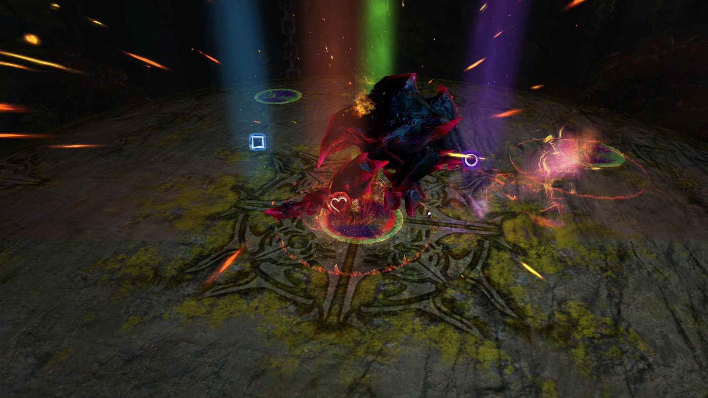
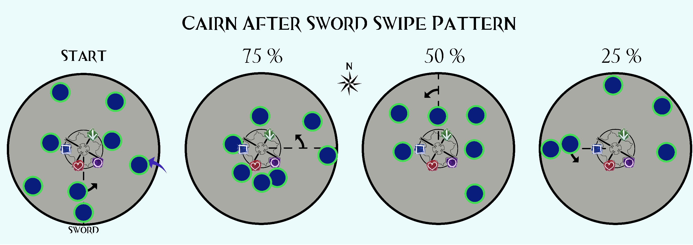

Cairn the indomitable is a pile of rocks, hence his name - man-made
stack of rocks.

## What sort of classes do I want to bring here?

- Damage type: Condi
- Tanking type: Furthest Player
- Healers: Solo heal or Duo

## Markers

Arrow is for the stack, other markers are where players with Shared
Agony can position themselves safely.

## Phases

Cairn has a total of 4 phases that he progresses through as his health
gets lower.

Every 25% of total hp will cause Cairn to enter a new phase.

- 100-75
- 75-50
- 50-25
- 25-0

## Platform Starting

As Cairn will only spawn after Glenna is spoken to and reaches the cliff
face above, once per instance cairn can be started with all 10 players
already on the platform. This allows for a much higher dps opening and
faster application of boons and will be standard in many of the pugs you
join.

Should the group /gg for any reason during the attempt made with
platform start - another attempt can not be made in the same instance
and the fight will have to be started by gliding into his arena from the
cliff.

## Special Action Key

The special action key mechanic for Cairn the indomitable is Celestial
Dash. This is a movement skill that is similar to a druid's ancestral
grace (staff 3).

Celestial Dash allows the user to move up to 1200 range and evades for
1¼s.

## Greens & Their Mechanics

Upon starting the fight Cairn will do an auto-attack chain which he will
end with sending shards out of his circle that knockback any players
they hit - either for being outside the circle or because they were
reflected.

If you are gliding into the platform a druid should block these shards
with staff 5 (or a heal firebrand with shield 5 etc.) to allow players
to get into the first green circle. This AA chain of punch-punch-shards
will repeat throughout the fight.

The first green circles people will use can be seen just behind the
arrow marker. This attack is named Spatial Manipulation and it will
repeat throughout the fight roughly every 30 seconds.

The number of stars above the circle indicate how many players are
required to be inside it during this attack to prevent the damage and
float.

Note the green circle with 4 stars, this is typically a choice for
groups with melee dps classes that want to stay in range.

Alternatively a green circle only requiring one player is right beside
it and will be the first circle groups come to as the fight begins.

In most cases while doing Cairn, training or not - the spatial
manipulation will be mitigated with stability and healing as this
negates the float and damage.

Common stability sources for this are Stand Your Ground (10 man) from
Guardians and Inspiring Reinforcement from Revenants.

## All Green Locations for Spatial Manipulation

There are always two green circles which only require one player to be
inside for Spatial Manipulation and it is common for groups who are
doing greens to send stack to a "2-star" green.

Players with agony should try and enter a 1 star circle to not be on the
stack.

## Shared Agony

Shared Agony is an effect applied every 20 seconds to the furthest
player from Cairn who does not currently have the effect.

This effect lasts for 60 seconds and deals 10% of the targets max hp as
damage every 3 seconds. Players who receive this red circle should leave
the arrow marker and walk around the inside of the ring to an available
marker on the other sides of Cairn (square, heart and circle).

As it is a 20 second CD for an effect that lasts 60 seconds, 3 players
will have agony at any given time once 3 players have been chosen with a
4th circle briefly as the effect expires on the first target.

Shared Agony deals damage to any players standing inside its AOE. The
closest target to the player with the effect will take 25% of their max
hp, any other players inside the AOE next to the first to be hit will
take damage also at 50% for the 2nd player and 75% for the 3rd player.

This is why players with Agony are recommended to take 1 star circles
during Spatial Manipulation unless skipping with stability.

The third agony can share a 2 star circle with someone else or go to a 1
star with another agony. If the agony targets are baiting the effect by
being furthest away on purpose an offheal or druid should have been
selected for atleast one of the 3.

Damage from Shared Agony can not be reduced with protection or frost
aura etc.

Invulnerability does prevent the damage from Shared Agony.

Downed players will neither deal nor receive damage from Shared Agony.

Shared Agony is only applied to players standing further than 180 units
away from cairn, as most melee attacks have a max range of 130 this can
be accomplished with lucky displacement spawns.

## Displacement

Displacements are teleport circles that spawn underneath cairn at the
start of his AA chain.

Displacements can be dodged, evaded or simply walked out of.

It is important to note that cairns AA chain will rip your aegis if he
is facing you and the teleport will place you outside of the inner
circle where you are vulnerable to being knocked back by his shards.

Players who are teleported often should expect to receive Agony as a
punishment for being out of position.

## Unseen Burden

Unseen Burden reduces your movement speed by 1% per stack up to 99
stacks leaving you barely able to walk out of Displacements. This is
what makes Dodging and Celestial dash so valuable for movement here.

You gain 1 stack of Unseen Burden per second, 25 for missing/skipping a
green circle and lose 25 stacks when doing the green circle mechanic.

Contrary to the tooltip, players will NOT be petrified at 99 stacks
unless the challenge mote is active.

Swiftness will still increase your movement speed by 33% helping to
bypass the stacking debuff.

## Energy Surge

Cairn will face a direction with an arrow beneath him showing where he
is going following a fixed pattern based on his health percentage.
Anyone in cairns way during his dash will be knocked back - posing a
risk sub 25% where he dashes back and forth in the same line multiple
times to knock players out of the greens they have already moved to
before the attack was finished.

Energy Surge happens every 90 seconds and the pattern is based on his HP
as shown in the image.

When above 50% health Cairn will leave a last circle in the middle, do
not get knocked back by his arrival and take this circle if you do not
have agony. The circles from this mechanic do not have a number of
players required as they have no stars above them.

## Pool Noodle

Every 90 seconds a large arrow will appear on the platform where Cairn
has turned to face. His arm will grow in size and he will slam it onto
the arena and spin around in one full circle knocking back everyone in
his path who does not dodge this attack. Dodge into Cairns arm to evade
this.

Cairn will spin anti-clockwise and if you dodge into the direction his
arm is travelling, too soon or too close to the base of his arm you can
be knocked back.

After this sweep Cairn will spawn circles at fixed locations again based
on his HP that only require one player inside as they do not have
stars.

## Important Note About Phasing Cairn

Cairn cycles through these mechanics in the order of Spatial
Manipulation, Energy Surge and Arm Sweep.

However this pattern resets for each health threshold meaning that if
you phase cairn beyond a 25% interval before he can use Energy Surge he
will not - instead the cycle will start again from Spatial Manipulation
with his new health % circles.

If you phase Cairn to a new health % that is below 50% after he started
the Energy Surge while above 50% there will still be a circle in the
middle as the pattern will not change mid attack.

## Gravity Wave

This final mechanic is only added after phasing cairn to 25%

At the end of Cairn's AA chain a new move will be added after the
knockback shards that sends out three cascading rings of jade.

As mentioned above if your DPS is high you will not even see this
mechanic, if your positioning is correct and you are inside the ring you
will not be hit by this mechanic.

Cairn will continue to do this attack at the end of his AA chain from
25% onwards, if damage slows down you might even see one.

## Tanking

There are two ways to tank Cairn, positioning yourself furthest away
inside the ring as one of the players who baited Agony on purpose or
kiting his attacks and shards from the edge of the arena.

Kiting has fallen out of even the slowest of training runs with the
introduction of 10 man Stand your Ground and certain healing specs with
mass resurrection.

However should you wish to Solo Cairn you may wish to adopt the kiting
strategy.

Even in solo's however this is not required Cairn's AA chain will deal
~4700 per punch and can be side-stepped while above 99 stacks of unseen
burden. This number can be further lowered with protection and frost
aura etc.

Aura Damage on Cairn averages out to ~1350, this can also be lowered
with protection.

## CM Mechanics

Unseen Burden turns you to Jade (Petrifies) at 99 stacks. Petrifaction
removes skills and disables normal movement, must be cleansed by using
Celestial Dash (action key) into a green circle - can not be cleansed in
enrage.

Celestial Dash must be used every 10 seconds or it will use itself at
max range in the direction the player is currently facing.

## A Note for Healers

Should someone down outside of the circle during Cairn and you do not
currently have a teleport to get them back inside the ring like search
and rescue or a projectile conversion to safely res them - value your
life more than those players and heal the rest of the team.
