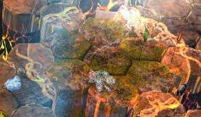

Cardinal Adina is the Cardinal of Earth. She's a djinn and one of the
first two bosses of Wing 7. The first two bosses (Cardinal Adina and
Cardinal Sabir) can be tackled in any order.

Personal opinion: I prefer to kill Adina first as she feels less
hectic.

------------------------------------------------------------------------

## What sort of classes do I want to bring here?

- Damage type: Power
- Tanking type: Toughness
- Healers: Solo heal or Duo
- Boon thief: Yes - you get Detonate Plasma from Adina but not the
Hands.

------------------------------------------------------------------------

## Markers for phases

{Picture}

------------------------------------------------------------------------

## Phases

There are three types of phases at Adina. We'll call them 1, 2 and 3.

1. Adina/pillar phase. This is how the fight starts - people get pillars
and have to place them, everyone else dpses and then everyone hides and
Adina destroys the pillars. Rinse and repeat.
2. Sand wall phase. Run away from the sand wall in an anti clockwise
direction towards the next phase's start marker. Don't run into any
mines. During this phase, mines will still explode and likely down you.
No dps needed.
3. Hand phase. Kill between 2 and 4 hands (2 in first of this phase, 4
otherwise). Move clockwise. The first time you do this phase you start
at circle. Every other time you start at arrow.

The fight goes:

- 1 (to 75%)
- 2
- 3
- 1 (to 50%)
- 2
- 3
- 1 (to 25%)
- 2
- 3
- 1 (to 0%)

------------------------------------------------------------------------

## Phase 1

At the start of the fight, there are 5 pillars surrounding Adina. These
are to protect from the deadly projectile Adina throws once her red aoe
covers the arena. Each pillar will protect up to two people from being
downed by effectively being in the way. If more than two people are
behind the pillar, the excess person or people will be downed (this is a
bit buggy so it could be a random person from another pillar). Rebound
has no effect on this.

During the fight, the 5 people furthest away from the boss will get
pillars. You get a message across your screen saying "You have been
marked for tectonic upheaval". Move away from the boss and place your
pillar at least 3 hexagons (floor tiles) away from the boss and with 1
hexagon between you and someone else. When a pillar is placed on the
floor, its circle changes to a scroll design. When this happens, get out
of the pillar circle and go back to the boss. The pillars slam up and
will instantly kill you if you're in their aoe.

If you have a boon thief, it is very important to make sure you are at
least 3 tiles away from them as the shockwave will apply a blind debuff
which cannot be removed until it expires. If a boon thief is blind, it
cannot steal so no boons for anyone!

Message when you get a pillar:

Pillar circle:

Pillar circle when placed before the pillar comes up:

Once you have placed your pillar, go back into the middle and dps
Adina.

Adina will throw her hands up in the air and then get an eye above her
head. Once the eye is above her head, she will blind anyone who is still
looking at her. Turn your character away and go hide behind your
pillar.

The blind is a debuff not a condition and cannot be removed - it will
eventually run out.

She also gets retaliation once she puts her hands up so be careful of
any aoe over time skills which can kill you due to the damage from
retaliation.

Chronomancers can leave their sword and disenchanter clones on Adina to
strip her boons. The retaliation lasts slightly longer than the pillars
being destroyed so be careful when you go back to Adina after this
happens if noone has stripped the boons.

The cycle of damage, pillar, damage, hide continues until the phase
changes (75%, 50% and 25%).

When a pillar absorbs the projectiles from Adina, it destroys the
pillar. Each pillar needs 2 hits to be destroyed.

For every pillar that isn't destroyed, Adina gets a buff. Each buff
makes her stronger by 20% (does 20% more damage and takes 20% less
damage).

If a damaged pillar is up , the tank can destroy it with the red cone
attack by causing that to happen where the pillar is. If you're not the
tank and you see that cone move, don't panic.

Damaged pillar:

Red cone:

As we want the pillars destroyed, if the squad is down to 9, only 4
pillars are needed. Only the number of pillars that correspond to the
number of full pairs left should be placed. In order to not have as many
pillars, two pillars should be placed on top of each other. This will
spawn one pillar instead of two.

If a damaged pillar is still up when the next set of pillars can be
placed, one person should hug that pillar with their aoe. The new pillar
spawning will destroy the old pillar.

Hugging aoes to merge pillars:

Hugging pillars to destroy damaged ones:

In the last phase (after 25%), there will be hands that spawn at the
edges of the platform. The alacrigade can put their Ventari bubble onto
the group to help if there's a lot of pressure. There's no need to kill
the hands - just kill Adina.

## Who wants to take pillars?

Due to the ranged nature of taking a pillar, often anyone with a ranged
weapon will take the pillar so that they can continue to damage whilst
going out.

- Dragonhunter - scepter or sword with well timed skills.
- Chronomancer - your clones are 1,200 range so can be used.
- Druid - you can use staff 3 to get back in quickly after placing
pillar.
- Alacrigade - give alacrity before going out and again when back in.
- Soulbeast - you can use leaps to go out and back in quickly or just
take a longbow for the range when going out.
- Holosmith - if you're sword then dodge backwards. If you have ranged
weapons then you can keep dpsing.

------------------------------------------------------------------------

## Phase 2

At 75%, 50% and 25% Adina will spawn 2 sand walls. They will start where
you enter the platform and go all the way across the entire platform.
She has one either side of her.

Do not get hit by the sand walls. They are instant death (like Sabetha's
flame walls).

Sand wall:

The walls will turn anti clockwise around the platform for a 365 degree
circle. You will want to follow them round, avoiding any mines left
over, and jumping any gaps in the floor.

You are aiming to get to the next phase's starter marker: circle at 75%,
arrow at 50% and 25%.

If you've started on the correct side, the wall will stop before it hits
the marker so you can just stop on the marker.

Each marker is 4 hexagons from the corner on the original platform - in
case you've forgotten to place markers.

On the 25% stage, you don't want to go to the outside ring of floor as
that will disappear. The middle ring is fine.

The floor that is going to disappear at the end of this phase gets an
orange overlay. Don't stand on these as you'll either get thrown into
quicksand or you'll get trapped under the floor. Make sure to be stood
on normal coloured brown floor at the end of the phase.

If you do get thrown into quicksand and there's no floor above you, use
space to jump and bounce yourself back to the platform. Remember sand is
bouncy in normal mode. It will give you the blind debuff if you go in
the sand.

At the end of this phase, do not run through the orange aoe in the
middle under Adina to get to the marker. Always run the long way around.
The middle is a death trap and will instantly kill you when she stops
floating.

Centre aoe:

------------------------------------------------------------------------

## Phase 3

Once you're done running from the sand wall, some earth elemental hands
will appear. At the 75% set of hands, there are two. At 50% and 25%
there are four hands. These are in the four corners of the newly shaped
platform.

There are two types of hands: Hand of Eruption and Hand of Erosion.

The Hands of Eruption clench into fists and throw projectiles at the
group which will knockback and damage anyone that they hit.

The usual tactic to counter this is to get the alacrigade to bring
Ventari and use the bubble skill on their tablet. It's unlikely they
will be able to also give alacrity for the 2nd and 3rd version of this
phase due to energy upkeep being needed for the bubble.

If you have no bubble, the druid can use staff 5 (flower wall) between
the hand throwing and the group to change the projectiles into healing
or a boon thief could bring shadow refuge or a tempest/weaver could
bring magnetic aura.

If this isn't available, or you are running between hands and are
outside the bubble, watch the hands - when they curl into a fist, they
are about to throw - dodge the projectiles that they throw.

Hands of Erosion give you a debuff which means you take 15% more damage
per stack.

During this phase Adina also does an attack which moves around the arena
creating a cone of the platform which lifts up and damages anyone caught
in it. We start at the markers we do in order to keep ourselves as far
ahead of this as possible. If damage is low, the attack will catch up
and will cause a lot of damage to the group. The quicker the hands are
killed, the better.

------------------------------------------------------------------------

## Tanking

Adina has a toughness related tanking mechanic, so the person with the
highest toughness will be the tank.

One choice here is boon thief as they can steal plasma from Adina and
give all the boons except alacrity and can evade her attacks with good
timing (although they now only do 5 man boons, so this has fallen out of
favour). Alternatively chrono or heal firebrand is quite a nice choice
although ultimately any class can actually tank Adina if they know the
timings of the attacks and have healers to keep them alive. Some groups
get their druid or tempest main healer to tank so that they're always in
the middle.

The main attack to block, stability or evade is the red cone. This will
knock you back a long way if you get hit by it. It can throw you into
the sand or into mines as they are likely to be behind you. The red cone
has quite a long time before it "explodes" from the time it appears so
practice makes perfect on the timing. If there are pillars still up at
this stage, you can aim the red cone at them to destroy them. Try not to
get other players in the red cone though.

The other attacks Adina does are like her attack in the Hands phase -
it's a cone that lifts the platform floor up and does damage. You can
face tank this. It can also be used to generate clones using sword 4 on
a chronomancer or be blocked using aegis or other methods of evading.
Avoid dodging for this as you don't want to hit everyone else with it.

Once pillars are placed, Adina throws her hands in the air and places
mines behind the tank in a cone pattern. Your job is to make sure that
the mines are placed in such a way that people can stand behind their
pillars without standing on the mines.

Avoid standing in the mines at all costs - they blow up, do loads of
damage and apply bleeding and weaken.

Adina will explode them at the end of Phase 1 anyway so make sure you
keep an eye on her health and be away from the mines at that point.
Their radius of explosion is one tile.

Two sets of mines:

------------------------------------------------------------------------

## CM mechanics

Sand walls - Adina gets 3 sandwalls. These appear in thirds of the
arena. You will have to run further than you think - they still do a 365
degree turn of the arena. The markers to start the Hands phases are the
same.

Sand - the quicksand beneath the arena is no longer bouncy. It will
instantly kill you if you hit it.

Pillars - there are still 5 but when a pillar is destroyed it will leave
a hole in the floor that only goes away when the platform changes shape.
This hole has quicksand beneath it that will instantly kill you. Do not
blindly run forward through your pillar once it's destroyed like you can
in normal mode. This includes the first already placed pillar. Place
your second, third etc pillars next to the gap created by the first one
to avoid lots of random holes in the floor.

------------------------------------------------------------------------

## Required masteries

None, although starting on a mount means you don't start with health
loss.
