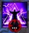
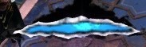
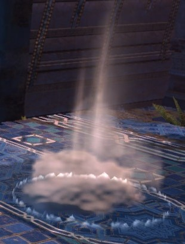
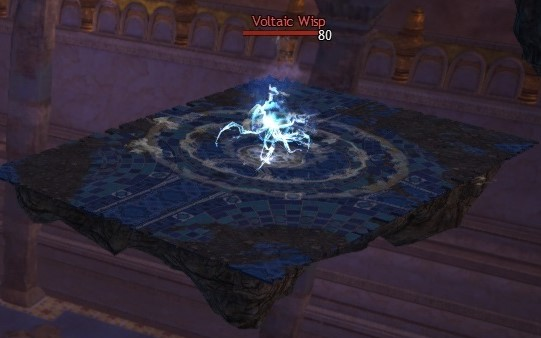
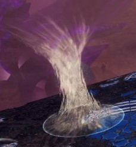
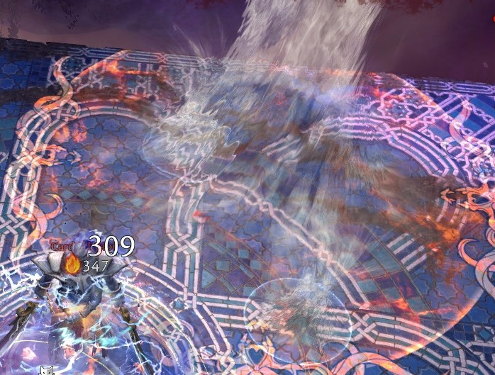
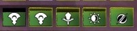
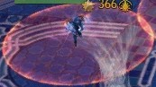
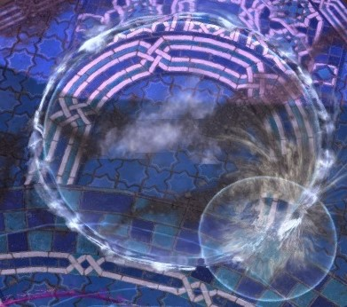

Cardinal Sabir is the Cardinal of Air. He's a djinn and one of the first
two bosses of Wing 7. The first two bosses (Cardinal Adina and Cardinal
Sabir) can be tackled in any order.

------------------------------------------------------------------------

## What sort of classes do I want to bring here?

- Damage type: Power or condition. (For CM, condition is better).
- Tanking type: Highest toughness.
- Healers: Solo heal or duo.
- Boon thief: No. The stolen skill here is Unstable Artifact.
- Mechanic skipping fiends: Holosmith (AED), Chronomancer (Sword 3),
Tempest (Rebound).

------------------------------------------------------------------------

## Markers for phases

{Pictures of where to stand/where mechanics happen on final platform}

------------------------------------------------------------------------

## Phases

There are three platform phases and the travel phase between each
platform at Sabir. We'll call them 1, 2, 3 and Travel.

1. The first platform. This is where you will start the fight after the
pre event. When you land on the platform, stay in the corner to avoid
triggering the fight. The first platform has the first type of cc
(yellow line cc).
2. The second platform. It starts the same as the first platform,
although you'll run straight to Sabir, avoiding white tornadoes. The
additional mechanic on this platform is a shockwave which is an instant
down mechanic if you get hit. White tornadoes being on the platform is
also new here, but you'll have seen them in the travel phases.
3. The third and final platform. There is a second type of cc mechanic
(no yellow lines - use special action keys). Avoid the giant red tornado
by moving clockwise. Go into circles at the corners of the platform.
Someone needs to kill whisps on small platforms alongside this one.
Includes all mechanics from previous platforms.

Travel phase. Use white tornadoes to fly. Avoid red tornadoes.

The fight goes:

- 1 (to 80%)
- Travel
- 2 (to 60%)
- Travel
- 3 (to 0%)

------------------------------------------------------------------------

## Phase 1

At the start of the fight, everyone runs in together and stacks on one
side of Sabir. Usually groups stack on the side that you enter the
platform from (for ease) - on the first platform, no one side is better.
Make sure you are stood in the middle of the semi circle at all phases
to ensure the white tornadoes don't pick you up. There aren't any white
tornadoes on the first platform but you want to practice for later
platforms.

{Picture of stacking point}

You will receive a special action key after being hit by Sabir a few
times. Throughout the fight on this platform, it is important to try and
hold onto your special action key as much as possible during the dps
phases. The special action key will increase the damage you do to Sabir.
It is also a really good cc skill.

You will get a bar over your head which fills up when Sabir hits you.
Once it is full, you'll gain the special action key. The special action
key will only disappear if you use it or you go into a white tornado.
You'll meet these white tornadoes later.

Sabir has two types of cc phase. You'll see the first one on this
platform. He will get yellow bars come out along the platform, he'll
push players away from him, and he will get a cc bar - you can still
attack Sabir, but it won't do any damage. He doesn't lose conditions
when he gains his cc bar, so you can still ramp those up, just he won't
take damage from them.

{Picture of yellow bar cc}

Do not get caught by a yellow bar. These cause a push back skill about
2s after they appear. It is quite a long way, so it can push you off the
platform. In normal mode they're fairly easy to avoid, so don't worry
too much.

The constant pushing back will mean that you have to run at Sabir whilst
his cc bar is up. The wind causing the constant pushing you away can
cause you to fall off the platform if you don't run against it. If you
do fall off a platform at any point in the fight, get your glider out
and get back as quickly as possible. There are updrafts around the
platforms - not that the ley line inside Sabir's room does **not**
work.

**Always** use the special action key on the floor in front of Sabir.
Sabir likes to push people outside of his hitbox, which is very
dangerous on the last platform. You can use any and all cc during this
cc phase (including your normal cc skills), but the special action key
will be your best one.

At the end of every cc phase, everyone gets a yellow circle around them
(like Matthias circles). These will damage people if you have them
inside your circle so spread out to avoid killing your friends! You can
take a white tornado in later phases if there is no room, as they're at
your feet vertically so won't damage people on the floor if you're high
enough.

Once you get Sabir to 80%, he will slam the floor. This is a knockdown
skill, which can be avoided by dodging. He then runs off and we
follow.

------------------------------------------------------------------------

## Travel Phase - between Platform 1 and 2 / Platform 2 and 3

This has 3 small platforms, 1 long platform and then 1 small platform.
Some advanced groups use portals to skip the long platform or even
additional platforms. This won't be explained in this section.

Your main means of getting from small platform to small platform (and
from Platform 1 to the jump section) is using the small jumping clouds
(I like to call them jumpy clouds). Just run into a cloud to be thrown
up to the next platform. The only platform in the travel phase without
one of these is the long platform.

The small platforms have a whisp (air elemental) on them. You can just
kill these normally, however you will experience a constant push back
whilst the whisp is alive. Each whisp has a cc bar. This can be broken
to make them much easier to kill, but it's not necessary during this
travel phase.

The whisps on later platforms will also throw projectiles at you. These
appear as orange aoe circles that fill up with red. Once full, anyone in
them will get stunned for a short period and will take quite a bit of
damage. For the unprepared, these aoe circles can down you on the
platform. If someone is downed, it is very important that everyone stops
moving forward and resses the downed player. If the squad gets to
Platform 2 with people too far below them, the players who are too far
below will instantly die as they become outside of the arena - this is
the same if people fall off during this phase.

{Picture of long platform with tornadoes}

The long platform has tornadoes on it. The white tornadoes will function
like the ones on the pre event and will throw you into the air so you
can glide to the next small platform. If you want to take the first
white tornado, you will need lean gliding and to open your glider at the
top of your jump to get to the small platform in one go - many players
prefer to take the second white tornado for this reason.

The red tornadoes are an instant death mechanic, much like Adina's sand
wall. They will kill you and throw you up into the air to spectate the
rest of the fight. The red tornadoes have a set pattern that they move
in, but it is always recommended to run behind the tornado (where
they've just been) instead of try your luck running across in front of
them.

------------------------------------------------------------------------

## Phase 2

Sabir will throw an auto attack at people who get onto this platform
first. You can dodge it or side step or just get hit in the face as long
as you aren't too low on health. Avoid the white tornadoes and run to
stack on Sabir like you did on Platform 1.

There are white tornadoes following a set path around the platform.
These will throw you up into the air and will remove your special action
key. It is important to avoid these as much as possible unless you are
using them to avoid the shockwave mechanic mentioned on Platform 2.
Going into a white tornado will cause it to spawn lightning rods from
its sides which will damage your teammates and remove their special
action keys, so do try and avoid it.

Shortly after you start hitting Sabir on this platform, he will do his
new mechanic. This is a shockwave which will instantly down anyone
caught by it. The telegraph for this is two orange circles going into
Sabir (much the same as the largos shockwave mechanic). It also makes a
brring brring noise.

The usual way of avoiding this is to run into a white tornado and glide
until the shockwave comes past you - so keep an eye out for where the
white tornadoes are. If you are a chronomancer, you can use sword 3
twice to skip the shockwave (or cs) - both require some practice.
Holosmiths can use AED to skip the shockwave. Tempests can use rebound
to skip the shockwave for the entire squad. You will need two tempests
to cover all of the shockwaves if you do this strategy (alternate them).
Obviously skipping the shockwave means more time to dps, but downing is
even more of a dps loss for the squad, so don't greed if you don't have
a way to skip. It is possible to use the special action key to skip by
moving away from Sabir then using the special action key through the
shockwave, but this does require a fair amount of practice. If you have
a special action key at this point, you can also use it to teleport into
a white tornado.

{Picture of shockwave tell - orange circles}

You will have to still do the mechanics that were on Platform 1 whilst
you dps Sabir down to 60%, at which point he'll do his knockdown and run
away thing again. If you are quick, you can sometimes get into a white
tornado to get a headstart on the next Travel phase.

------------------------------------------------------------------------

## Phase 3

The final platform is where the chaos happens! Sabir now has all of his
mechanics and your main job is going to turn from doing loads of damage
to not dying - if we have fewer than 6 people on the last platform, one
of the special mechanics becomes basically impossible to do, so you
might as well gg unless at like 2%.

Remember you start this platform at 60%. It is very important that
everyone stacks during this phase as much as possible. You will also
need a bit of patience and someone to call using the special action key
for co-ordinated cc. Start the fight on Platform 3 by stacking on the
side of Sabir that you entered the platform from.

From 50% onwards, Platform 3 has a giant red tornado that goes around
the Platform clockwise. It starts on the left side of Sabir to the one
you entered from, which is why we start stacking where we do - you
always want to be on the red tornado's left (as you look at it) so that
you are chasing it and not the other way around.

Being hit by the red tornado will instantly kill you and you get to
spend the rest of the fight spectating in the air. It is very important
to not use dash skills during Platform 3 unless it stops just before
Sabir, as he pushes people out of his hitbox and likes to push people
into the red tornado. Try to avoid random placement leap skills too such
as mirage axe 3 and chronomancer sword 3 (twice).

Sabir's new cc mechanic is to gain a defiance (cc) bar but not have
yellow bars coming out from him. If this happens, do not use your cc
yet! Everyone needs to stand in front of Sabir and get their special
action key. The person appointed caller for this Platform will watch the
squad UI to see who has the special action key. Any person with it will
be outlined in yellow on the squad UI - note barrier can make this
really hard to see, but you can still see the bottom of the box with the
yellow line around it. Once 7 or more people have the special action
key, the caller will count down and then tell you to use your cc.
Everyone must use their special action key.

This cc bar is really big and regenerates really quickly, which is why
it's important to use your special action keys together. 7 is enough to
break the bar, however if they are a little spaced out, the bar may not
be broken. All normal cc can be used to break the last little bit of the
bar. If the bar isn't broken and isn't low enough for normal cc (more
than 20% left), then do not keep using your cc - wait until everyone
gets their special action keys back to try again. In training runs, it
is often useful to wait until everyone gets their special action keys to
avoid having to do it twice. Oh and use your special action key at your
feet as you'll be hugging Sabir to do damage anyway.

As at the end of all cc phases, everyone gets a yellow aoe circle around
them - spread out to avoid killing each other but watch out for the red
tornado!

During this cc phase, Sabir gets a buff icon. This reduces the damage he
takes by 5% per stack and increases the damage he does by 3% per stack -
if it gets to 20 stacks, you will do no damage, but lifesteal will still
work. It is important to cc him as soon as enough people get the special
action key to avoid him getting too many stacks.

At 40%, a platform will spawn alongside Platform 3. This will have a
whisp on it. Further platforms will spawn throughout the fight and will
also have whisps on them. These whisps will throw projectiles at the
main platform. Getting hit by one will cause you to be immobilised for a
short time - the aoe circles will also do the same as they did in the
travel phase (damage and stun). If lots of whisps are up, this can
become very dangerous.

Usually one or two people are chosen to go and kill the whisps. As
whisps are easiest to kill when their cc bar is broken, use your special
action key to teleport from the main platform onto the whisp on the
small one, finish breaking the cc bar and then kill the whisp. Once the
whisp is dead, come back to the main platform. Note that more than one
whisp can appear on each platform. If you use the white tornado to glide
over, you will have to do a lot more cc as you won't have the special
action key. Usually the banner warrior is sent, but any class that does
dps and has some cc will work.

Once the first platform is up, you will end up killing whisps near
constantly, coming back to the main platform to get the special action
key and to be healed/get boons. If the squad is struggling with the
co-ordinated cc, you can help them when you are on the platform. Be
aware of where the red tornado is so that you don't fly back into it.

{Picture of whisps on small platforms alongside the main one}

One of Sabir's other mechanics on Platform 3 is to put two circles on
opposite corners of the platform and then to electrify the floor. The
telegraph for this is Sabir doing a little twirl. You must be inside the
circles (they are cylinders so above works too) when the floor is
electrified, otherwise you get downed. Where possible, always go to the
circle that is furthest from where the red tornado is going. You can
still be hit by the whisp projectiles whilst inside the circles - the
whisp projectiles are quite dangerous during this mechanic as they can
stop you from getting to the circles. Something like magnetic aura or a
ventari bubble can help with this if your squad is struggling.

Do note that you will need your shaders/character model limit on at
least medium to be able to see the circles. If you can't see them,
follow everyone else. They are only on two of the corners at a time.

Remember you'll also have all the mechanics from the previous platforms.
This is why Platform 3 on Sabir is managed chaos!

------------------------------------------------------------------------

## Tanking

Sabir has a toughness tanking mechanic. However, it doesn't really
matter who the tank is, as usually the squad stacks together (including
the tank) anyway. If you are struggling with squishy people being hit by
the auto attacks in the later stages, the tank can stand to one side.
Remember you will need to stand in front of Sabir to get your special
action key though.

------------------------------------------------------------------------

## CM mechanics

Ressing - it is much harder to res downed people on CM. Everyone needs
to be ressing any downed person - if it doesn't say there are too many
resurrectors, not enough people are ressing. One epidemic scourge can
also take blood magic to pull downed people onto the stack to res them
and save everyone having to chase after downed people.

Whisps - there are now whisps on the platform. The usual way to deal
with these is to take a condition heavy composition and to include at
least one, but preferably two, epidemic scourges. Each whisp will
require 1-2 epidemics to kill them.

Yellow lines in cc phase - there are now five of these instead of
three.

------------------------------------------------------------------------

## Required masteries

None, although updraft and lean gliding are helpful. You can do the
whole fight without gliding if needed, it's just quite a bit harder.
