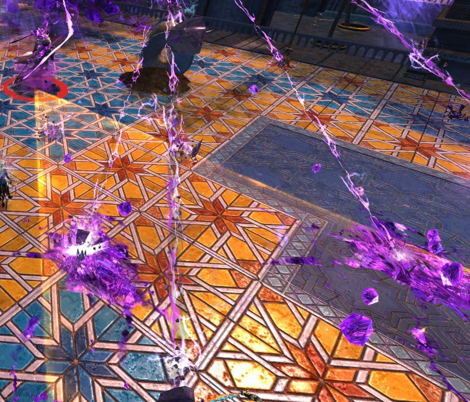

Gate is the event at the start of Wing 7. It's basically a Point Capture
event to start with and then becomes a Bounty event.

## Capture event phase

Your job is to stand in the big red circles and kill or push the enemies
outside of the circles. If there are no enemies in the circles, they
turn blue and progress towards the capture event starts ticking up. If
any enemies spawn in the circle or run into the circle, it turns red
again and progress towards the capture event stops.

Blue circle:

Red circle:

It's a good idea to bring skills that can push or pull enemies outside
of the circle.

The other tactic used is to stand at the edge of the circle to body
block any enemies that rush at you. This is particularly important to do
for any djinn that are aggroed.

## Djinn

Throughout the event, there will be djinn. There is one at the first
circle, one between circles 2 and 3 and one after circle 4. You have to
aggro and kill the first two, but can often avoid the third one with
clever positioning.

You will want to always ensure that the djinn does not make it inside
the circle. It takes a little while to kill each djinn so if it gets
into the circle, this is time you can't capture it.

There will also be djinn in the second stage of the event, which are the
same as these djinn.

Djinn being body blocked from entering the circle:

Djinn start their lives with a breakbar. Once this is broken, they stop
attacking and have a rest on the floor for a little bit before they
continue attacking them. Ideally, you would break the bar as quickly as
possible, and then burst down the djinn before it gets back up.

Djinn have a couple of main attacks other than just smacking you in the
face.

1. Orange cone attack - as it sounds, this is telegraphed by a big
orange cone in front of the djinn. The djinn then smacks the floor and
creates a load of damaging crystals in the area covered by the cone.
This can do a lot of damage and can down squishy players, so don't stand
in it.
2. Orange circles - these appear around the djinn and do a lot of
damage. Avoid them where possible.

Tips:

- If you are squishy, stand behind the djinn.
- Break the cc bar asap to stop the djinn attacking.
- Don't stand still but stay in range of your healer.
- Springers have cc on their active skill so are good to start on to
help break the cc bar. Note the first djinn in the 2nd phase - you have
to wait for the breakbar to appear as it has a delay from spawning.

Orange cone attacks:

## Phase 2 - after the circles

There are only 4 capture circles to get. Once these 4 have been
captured, all remaining djinn and most of the enemies will disappear. At
this point, your job becomes twofold:

1. Protect Glenna as she opens the gate with the fragments of the Key of
Ahdashim.
2. Kill the 3 djinn that will spawn from the rifts.

You will usually send a healer and one dps player to protect Glenna at
the gate. Waves of enemies will spawn and try to kill her, so it is
important to keep them away from Glenna (and as dead as possible).

Everyone else goes and clears the three djinn. These are just like the
djinn in the first phase, so the same tactics are used. During this
phase you can mostly ignore the other enemies if you are not staying
with Glenna. If they get really annoying, sure kill them, but otherwise
just keep moving.

It's important to note that you will likely have 1 healer with you
during this phase, so don't do anything really silly and purposefully
stand in all the aoes or get smacked in the face a lot and expect your
healer to keep you alive. If you do it a lot, they will probably get
bored of healing you through it and let you kill yourself.

Waiting at the djinn rift:

Most groups go to the rift that's to the left of the Gate (as you look
at it), and then go and do the two to the right. This is because the
left rift's djinn is the one most likely to be accidentally aggroed by
the duo left at the Gate. Letting a djinn aggro near Glenna is stressful
for the healer so be nice to them and clear that one first.

{Map of the djinn spawns}

Once all 3 djinn are killed, the Gate will open and you can ignore the
other enemies and run through the Gate and on to the dialogue before the
raid bosses.

If your group dies at all, they can leave the instance to the aerodrome,
res and come back into the instance alive to carry on. You can also time
out the event (the timer for phase 2 is 5 minutes), but the fastest way
is to kill the djinn.

You can also skip the dialogue after Gate by the entire squad leaving
and rejoining the instance.
