Once you've killed Vale Guardian and out run the ghosts in the Spirit
Woods event, you face Gorseval as the second boss in Wing 1. He has lots
of tentacles and likes to slam the floor, knocking people over.

------------------------------------------------------------------------

## What sort of classes do I want to bring here?

- Damage type: Power. There is a condi strategy for orb clearing but power
is generally better here.
- Tanking type: Highest toughness.
- Healers: Solo heal or duo.
- Boon thief: No. The stolen skill here is Unstable Artifact.
- Encounter specific mechanics: Bring immobilise for the big spirits.
Stability or aegis for the slams.

------------------------------------------------------------------------

## Markers for split phase

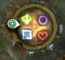

------------------------------------------------------------------------

## Phases

There are three main types of phases at Gorseval. I've added a 4th one -
phase 1a - which covers the additional mechanics of phase 1 in later
versions of it.

1. Attack phase – Gorseval swipes at the tank and slams the floor
knocking people without stability/aegis over. The stack stands at his
tail and smacks him, cleaving little ghosts as much as possible. From
66% onwards, blue orbs can appear which give debuffs if you stand in
them.
2. Tantrum phase – damaging blue/black goo covers the floor in various
patterns, Gorseval gets a buff that deals damage when you do damage to
him and a breakbar – the goo stops when this is broken.
3. Split phase – there are 4 big ghosts which appear in the 4 “corners”
of the platform. Start at arrow or arrow/square and kill them before
they get to Gorseval – immobilise is really helpful here.

The fight goes:

- 1
– 2
– 1 (to 66%)
– 3
– 1a
– 2
– 1a (to 33%)
– 3
– 1a
– 2 
– 1a (to 0%)

------------------------------------------------------------------------

## Phase 1

The fight starts when everyone runs in – he’ll aggro about halfway
towards him.

Gorseval has a main attack pattern. He does a swipe and then a stomp. He
will usually do this when the group runs in. If possible, use aegis or
stability or distortion on the stomp or dodge. The stomp will knock you
over if not blocked or evaded. He will swipe at the tank but the stomp
affects everyone close enough. As everyone except the tank should be
under Gorseval's tail, it will hit everyone. Once he does the stomp,
Gorseval will swipe again or start his tantrum attack. Usually
chronomancers, firebrands or an alacrigade with dwarf stance will be in
charge of giving aegis/stability to the squad.

Do as much burst dps as possible before he starts the tantrum attack as
you’ll likely have to slow down whilst that’s active.

{Picture of small ghosts}

There are small ghosts which appear throughout the fight, mostly during
this phase. These should be pulled into the centre so that the squad can
cleave them down whilst still focusing on Gorseval.

Note if you don't pull and kill the little ghosts, they can interrupt
the druid when they are immobilising the big ghosts which will normally
mean Gorseval eats one or more big ghosts. Starve Gorseval, kill the
little ghosts!

------------------------------------------------------------------------

## Phase 2

Gorseval's most damaging attack is his "tantrum". He starts hitting the
floor and a big aoe field appears on the floor. Do not stand in the blue
and black AoE field - it hurts. The field changes shape every couple of
seconds so you'll likely have to move.

The floor segments last 3 seconds before they change, apply 25 stacks of
vulnerability, and explode at the end of their 3 seconds for a large
chunk of your health.

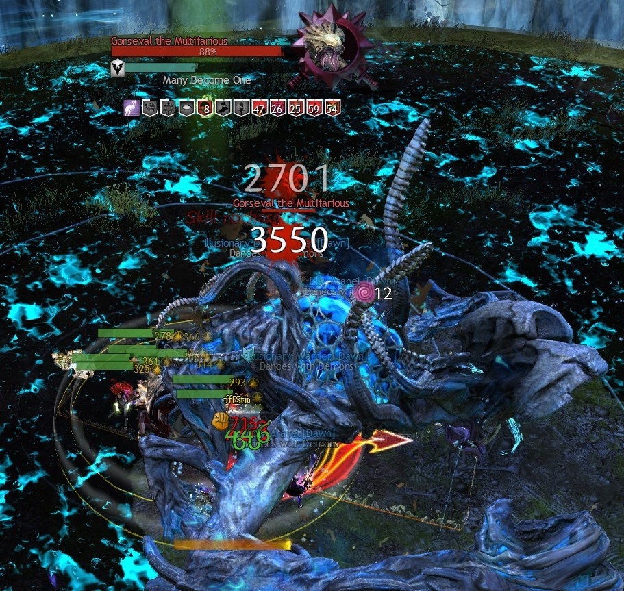

During this time Gorseval gains a buff which does damage when you do
damage to him, and a breakbar. You cannot strip the buff, which is
active as long as Gorseval is having a tantrum. Watch your bursts and
don't kill yourself. Skills that heal when you do damage, like Litany of
Wrath for guardians are great here. Otherwise your healers will try and
heal you through it, but a group doing lots of dps with slow cc can
easily kill themselves.

There are two main strategies for the breakbar. The lesser used one is
fast cc. This involves removing the breakbar as quickly as possible. If
your group has very high dps, this is a great strategy. Usually
regardless of strategy, you want Gorseval’s health to be at least 80%
before the bar breaks as you then need to get him to 66% before he
destroys the world.

{Picture of wall}

If your dps is really low, fast cc is also used for the “updraft”
strategy. Once Gorseval is broken, the floor field disappears and the
tank pulls Gorseval towards a wall. The squad then attack the wall and
fly into the updraft behind it to avoid the large red aoe that spawns on
the platform.

You need to wait until the red is very near the edge before you jump as
the attack happens when it gets to the edge and the updraft times out.
Everyone must go fly together to ensure everyone can access the updraft.
If you get hit by the shockwave, it will instantly kill you. Be careful
– if you have small ghosts up and you’ve destroyed the barrier, the
little ghosts can kick you and knock you off the platform.

There are 4 updrafts around the edge of the platform, outside of the
wall. Only use them if needed. Note that many groups do “last updraft”
which means they’ll do the medium cc strategy for the first two tantrums
and then fast cc strategy for the final tantrum.

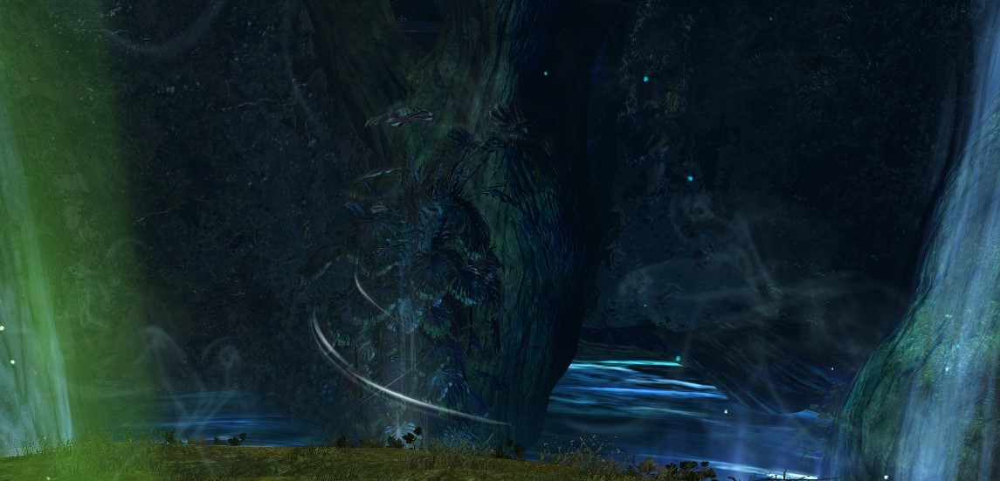

The more common strategy is medium to slow cc. Here the group moves with
the floor aoe until it covers the arena, whilst dpsing Gorseval to at
least 80%. Then the cc bar is broken and high dps is done to get
Gorseval to 66% before the red AoE fills the entire platform. If it
fills the platform before Gorseval gets to 66%, the squad is killed.
This is called “World Ender”.

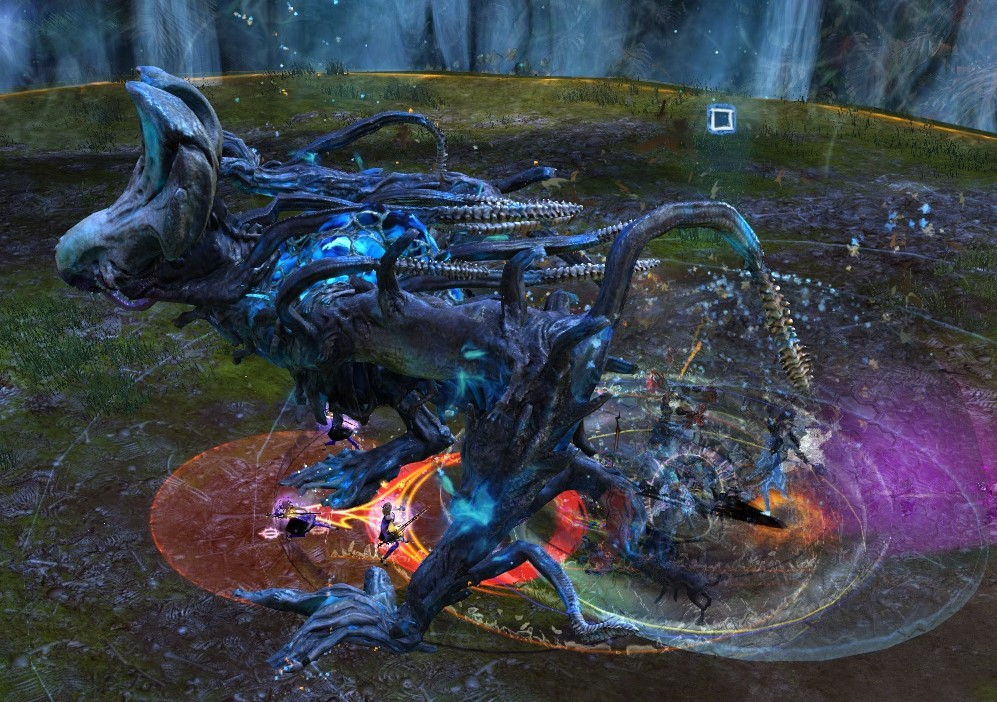

------------------------------------------------------------------------

## Phase 3

At the 66% and 33% marks, Gorseval becomes invulnerable with a shield in
the centre. Note you can walk through both him and the shield as long as
you have melee attack assist off. If you don’t have it off, go read
[graphics-settings]!

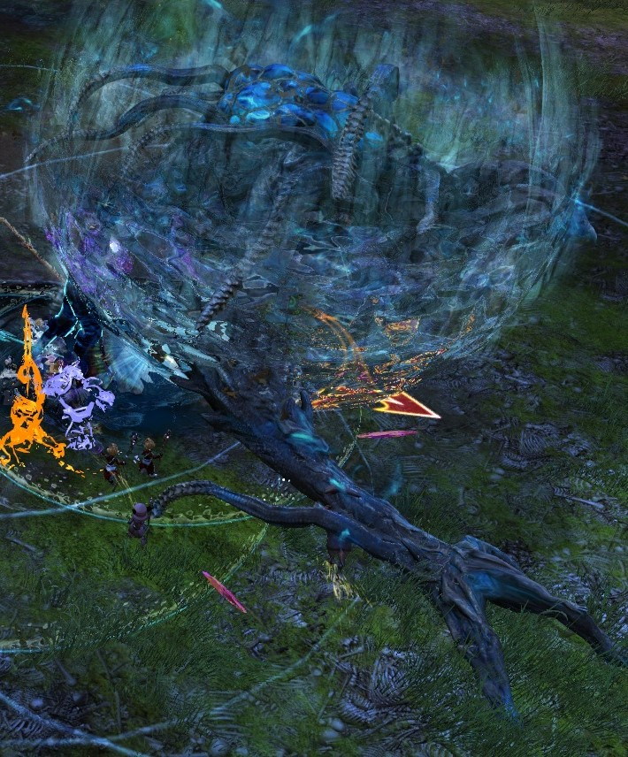

Four big ghosts appear in the same directions as the updrafts. See the
marker picture at the start of this guide for where they appear.

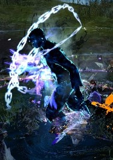

There are 2 strategies most groups use: all together and 2-way split. It
is possible to do up to a 4-way split, but most do up to 2.

All together: Start by killing the ghost at arrow as it will be behind
the group. Then go clockwise to kill each ghost. The entire group goes
together except for the druid who has a special job. As the group won't
kill the four ghosts before they get to Gorseval without them being
stopped, that is the druid's job. They will usually stop the last 2
ghosts before they get to Gorseval with an immobilise. Entangle, staff
4, jacaranda and CA5 can all be used depending on your group’s
experience.

Two-way split: The subgroups are split between arrow and square markers.
They start at these, kill their ghost and then go to the other two
ghosts. Arrow group goes to circle and square group goes to heart. If
your subgroups are fairly balanced dps wise, this can be the better
strategy as you’ll have less chance of a ghost being eaten by
Gorseval.

If a big ghost gets to Gorseval, he eats them and then does his World
Ender attack which will wipe the group.

------------------------------------------------------------------------

## Phase 1a - additional mechanics in later phase 1s

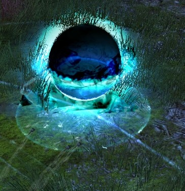

After the split phase at 66%, blue orbs will start to spawn around the
arena. These orbs have an expanding AoE field which is also blue. Do not
stand in the field. If you do, you get a ghost over your head and a
ticking damage debuff which also means you hit like a wet blanket.

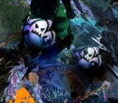

If you get a ghost debuff, you need to pick up small gold orbs. These
gold orbs can be created by killing a blue orb. You will need to pick up
two gold orbs as your debuff has 10 stacks and one gold orb clears 5
stacks of the debuff.

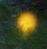

One or two people get designated as orb clearers. Their job is to kill
the orbs with a ranged weapon to keep the arena clear enough to move in
and to keep a corridor free to a wall with an updraft in case it is
needed. Usually dragonhunter is used with scepter for this though any
ranged weapons work. No the healers do not count as having ranged
weapons. Another strategy is to use a scourge with epidemic to clear the
orbs. The orbs will not disappear unless you clear them.

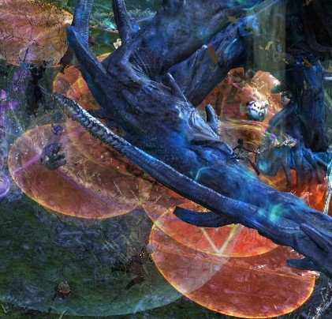

There is an attack where gold circles appear at the feet of players.
This is the "egg" attack. It has a ping noise if your effects are turned
up. Calmly walk out of the egg circle and onto clear floor. If you do
manage to get caught in an egg, use your 1 skill to break out. Other
people can help break you out but they probably won't notice you're
stuck.

If you're in a coordinated group, everyone stacking the eggs in one
place and then instantly breaking them with the 1 skill can be a viable
strategy, but does require good coordination and close stacking.

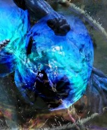

------------------------------------------------------------------------

## Tanking

The person with the highest toughness will be the tank. Any class can
tank Gorseval as he doesn’t hit that hard. Many people will tank
Gorseval at 1,005 toughness because of this, or make any soulbeast in
the group (with 1,150 base toughness) be the tank.

Tanking here is easy – your main job is to stand still in front of
Gorseval so he doesn’t go wandering off during the burst phases. The
only time you want to move him is if you’re going to use an updraft or
if the middle is covered in blue orbs (then the blue orbs should be
cleared, not Gorseval moved).

It’s important for everyone to note that Gorseval will always jump to
the middle to do his tantrum attack regardless of where you’re tanking
him.

------------------------------------------------------------------------

## Masteries

For this fight you’re expected to have the Updrafts gliding mastery. You
can get around having to have that mastery if you have high group dps
(don’t need to do the updraft strategy to phase him to 66%, 33% and 0%),
and if a friendly mesmer portals you to the platform at the start.
