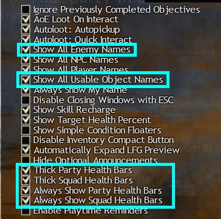
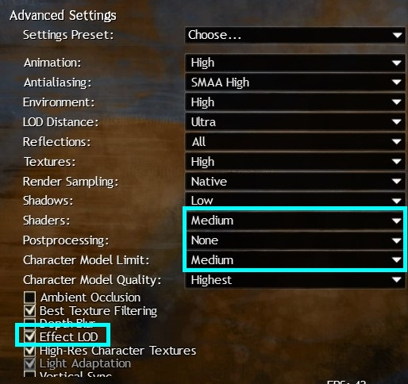
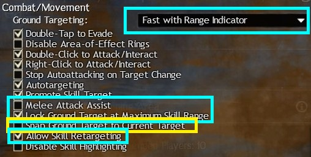
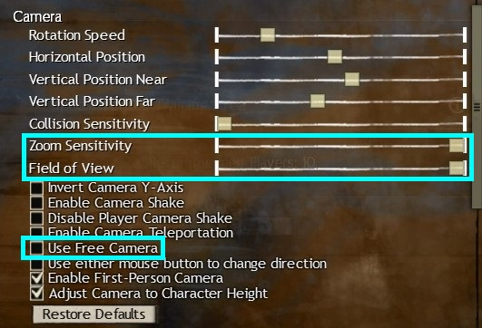
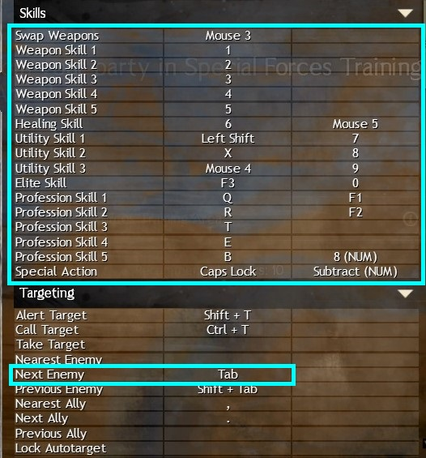

In the following pictures, the blue boxed items are recommended as
minimum settings.

Every other setting is optional or personal - some of the blue are also
optional, but I find they make raids easier. They'll be explained why
below.

------------------------------------------------------------------------

## Health bars

It's really helpful, especially if you're a healer or support class, to
have health bars above everyone. Having people's names can be
distracting, but having health bars will make it easier to see where
your friends are. If you need to throw something at them, like at
Sabetha, having easy ways to see them is helpful. Thick bars are
optional but I find it makes them easier to see.

I'd also suggest turning on enemy names to make them more visible and to
turn on usable object names. Usable objects are things like the beehives
at Trio.

------------------------------------------------------------------------

## Graphics Settings

It's important to have your Shaders and Character Model Limit at Medium
or higher. If they're lower than that, you won't be able to see all of
the mechanics and items mentioned in these guides. If you have to turn
all of your other settings down, still try to keep these at Medium. If
you have a good pc and can have them higher, feel free to.

Post processing makes everything shinier. In raids there is a lot of
shiny. Turning it down drastically reduces the visual clutter. It does
also turn off some effects in raids - the blind effect at Adina won't
show if you're on None for post processing.

Effect LOD being turned on also reduces the visual clutter as it lowers
the effects from people who are not in your subgroup.

------------------------------------------------------------------------

## Targeting

For your ground targeting, the best option is Fast with Range Indicator.
You can also use Instant. Whatever you do, please don't use Normal.
There are special action keys in raids - you're going to want to not
have to press a button for it and press it again to activate it as that
will take too long.

Other than the medium settings above, this one is the most important for
raids: Turn OFF Melee Attack Assist!!!!! If this box is ticked, you
cannot stand in a boss' hitbox or run through it. In raids the effects
of this range from "do less damage as can't stand in hitbox" to "die
because I couldn't run through the boss".

Allow skill retargeting lets you change target mid cast, say if your
first target died. Super handy.

Snap Ground Target to Current Target: a bit of a marmite setting. I
can't use it personally. It's useful for things like bringing Feedback
at Matthias - it will cause your ground targeted AoE skills to put
themselves on your target unless you make an effort to move them away.

Lock Ground Target at Maximum Skill Range - I really like this setting.
It stops you accidentally casting your ground targeted skills outside of
their range. If you run it with the recommended targeting option, you
can run the skill aoe in a circle at max range to find where you want to
put it.

------------------------------------------------------------------------

## Camera settings

Having Field of View all the way out makes it easier to see everything
that is going on in raids. Raid fights always zoom you in when they
start, so having zoom sensitivity all the way up lets you scroll back
out really quickly.

Also I've recently found out that having Use Free Camera ticked was the
reason my character was walking in the wrong direction or dodging in the
wrong direction. Please untick it if you value your sanity or want to
always go in the direction you expect to!

------------------------------------------------------------------------

## Key Binds

I'm not going to tell you which key binds to use. That's entirely
personal preference. However I am going to recommend you take time to
find key binds that work for you for the boxed items below. Don't just
stick to the defaults - try out ones to see if they work for you. I'm a
skill clicker ("omg no!" I hear you all gasp) but I still have key binds
for all of those so I can press buttons on my keyboard or mouse for all
of them if I have the brain power to remember them.

Oh one other thing - I'd suggest turning off Autorun. If you
accidentally press it in a raid, you could run yourself into an instant
death mechanic.

------------------------------------------------------------------------
