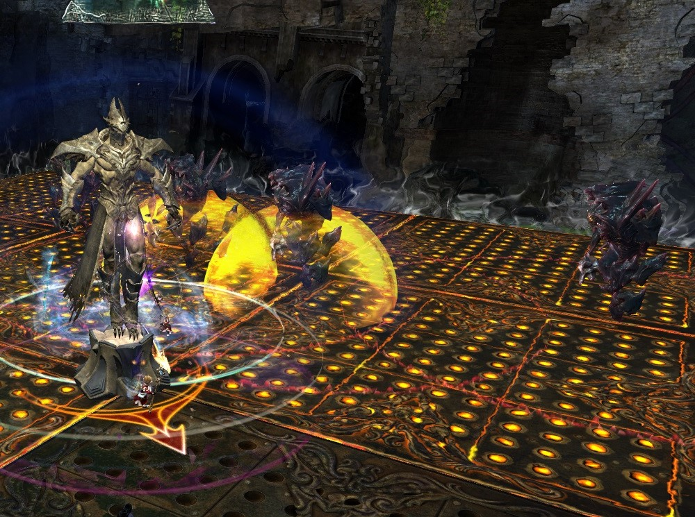

Mursaat Overseer is the opposing king on this chess-board themed
arena.

## What sort of classes do I want to bring here?

- Damage Type: Condi (Epi strat) Power (Fast)
- Tanking type: Claim Special Action
- Healers: Solo heal or Duo

## Markers

Arrow to square along the back wall for Jade callouts.

## Phases

Mursaat Overseer has 4 phases based on health %.

Similar to Cairn these phases are every 25% of the boss hp.

## The Special Action Skills

Along the edge of the arena, there are 3 special action skills. These
skills are claim, dispel and protect. MO will turn hostile when all 3
are collected.

**Claim** will make the holder the tank in this encounter and allow the
wieldier to claim MO's orange tiles and deactivate them for players to
stand on safely.

**Dispel** will give the wielder a projectile that can be fired at Jades
to remove their shield.

**Protect** will make the wielder the fixate target of the Jades when
they transform, making it important for the holder to position
themselves on the edge of the tiles to not allow Jades to claim friendly
tiles where possible - its active skill makes a dome of invulnerability
for 5 seconds.

If any of the players holding a skill dies, the skill will respawn in
its starting location and can be collected mid-fight.

A player holding the claim special action will be marked with a diamond
over their head.

## Starting Locations for tanking

MO is incredibly vulnerable during the start of the encounter as his
starting tile and main mechanics have not started to interact with the
group yet.

This makes it the ideal time to open with a high dps burn where
conditions are stacked onto the boss for an epidemic in condition
strategies or to gauge group dps as a power composition.

The epidemic will hit three Jades if the tank positions slightly to the
right, near the marking on the edge of the centre top tile.

When using a power comp the main consideration for tanking is to allow
players who need to flank easy access to flanking.

## Jades

There are two forms of Jade enemies in the MO encounter, Scouts and
Soldiers. Both types of Jade claim a tile for MO by moving onto it.

Jade Scouts spawn on the far side of the arena under the markers at the
start of the Mursaat Overseer encounter and begin slowly moving to the
other side. Any Jade Scouts that reach the end will be promoted to Jade
Soldiers just like in chess.

Jade Scouts will stop moving for 30 seconds when their health reaches 0,
they will show that they have died by turning invulnerable and beginning
to heal back to full hp.

A Scout who is not "dead" can become immune to damage by being granted a
shield buff from the Mursaat Overseer. This shield must be removed by
the dispel SAK projectile - as it is a projectile MO can body block the
shot by being inbetween the user and the target. It is important to step
to the side before firing to avoid this as the skill will go on CD.  
There can be multiple shields placed on Scouts and Soldiers at the same
time if removal is not done consistently upon application of the buff
making the encounter slightly harder.

Soldiers will target the player who is holding the Protect SAK and
attempt to claim the tile, do not let the Jade on and use resistance or
cleanse skills to ignore their aura which applies slow, torment and
poison.

Upon death the Jade Soldiers will explode for moderate damage and
respawn as a Jade Scout 30 seconds after their explosion.

You can see an explosion is about to happen as the Jade Soldier will
hunch over, pull his arms in and then throw them out as he explodes.

If many Jades are going to explode at the same time, this is a good time
to use protect to prevent a wipe.

In power comps you may choose to allow 3 Jades to transform
intentionally, protect their explosions and continue to kill the boss
before another set can transform.

## Spikes

As orange tiles only deal ~3.5K damage and can be claimed back, it is
entirely possible to stay on the starting tile for the entire fight
assuming high enough damage.

Spikes will kill any player standing on the tile who is not inside a
protect SAK when they rise.

The tile you can stand on is dictated by where the spikes will spawn in
the pattern, the pattern is as follows:

As mentioned above this pattern is dependant on MO's hp %, with high
enough damage and protect this allows for a kill in which the group did
not need to move from the starting tile.

It is preferable to tank only on the centre 4 tiles to reduce the amount
of movement required.

If DPS is lacking and the fight will last for long enough sub 25% there
will be no safe tile in the centre 4 on which to tank. The group will
require either the placement of the protect SAK to gain invulnerability
from the spikes or going to the bottom left corner to avoid the
spikes.

Spikes about to come out of the ground.

Spikes delivering their attack.

## CM Mechanics

When the CM is turned on tiles may also turn blue, these tiles are
client side so will be different for everyone in your group. There will
always be a safe tile in the centre 4.

These blue tiles will appear every 30 seconds and will kill any players
not standing inside one after 4 seconds, as they appear outside of the
starting tile this will force players to spread out to the middle 4 and
causes an interesting interaction with spikes.

If the blue pattern syncs up with a spike spawn in the centre 4 tiles,
the player with protection should place protection in the centre of the
arena.

Protection can save you from the spikes but NOT the blue tiles,
therefore you MUST stand in your blue.

## Notes

It is worth noting that standing on the edge of a tile does not count as
being on the tile for blues as standing on the edge of the tile doesn't
count for being off of the spikes. This is likely to prevent players
from stacking directly in the centre all the time for blues.

MO is an incredibly short encounter with good groups taking just over a
minute and even beginner trainings finishing in roughly 2 and while boon
thief no longer does 10 person boons it is still worth bringing DD's as
they can unlock the door after the encounter and are the strongest CC
option in the game currently for Samarog.

MO will become empowered by each soldier active at the time, but given
that MO only uses Aura damage you probably wont notice or care.

## For opening the door after MO, before Samarog

If you don't have a thief in your squad, there's a minigame to open the
door. There are 4 keys you have to collect after talking to the door
first to get the ability to see where the keys are. See the video for
where to find the keys in the rubble piles. One person can do them all
if your squad is lazy or you can race each other to get all the keys
back.

<https://www.youtube.com/watch?v=SFwArL2bOKs>
