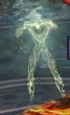
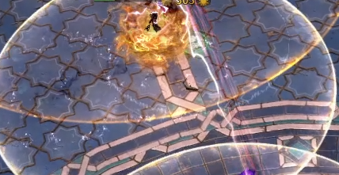
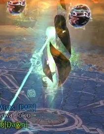

Qadim the Peerless is a djinn and the last boss of Wing 7. He is the
"enhanced" version of the last boss of Wing 6, Qadim, however the Wing
7 Qadim the Peerless is a lot easier than his original form.

------------------------------------------------------------------------

## What sort of classes do I want to bring here?

- Damage type: Power or condition.
- Tanking type: Special action key/proximity.
- Healers: Solo heal or duo (ideally 2nd would be a pylon).
- Boon thief: No. The stolen skill here is Unstable Artifact.
- Pylons: the usual choices are scourge or deadeye. Other classes like
mirage (staff) or renegade can sometimes be used - the class needs to be
able to look after itself.

------------------------------------------------------------------------

## Markers for phases

There are different methods for placing fires. My personal favourite is
below. Many pug groups use the left then right method. Some groups use
the go left twice method. If you are fighting this boss with people you
don't usually raid with, check with them how they want the fires
placed.

The purple arrows are where the anomalies (sparkly guys that look like
VG) walk - these are the reason that we place the fires where we do.

An alternative mentioned above is the both left combination:

------------------------------------------------------------------------

## Phases

There are 4 main types of phases at Qadim the Peerless. To be really
original, I'll call them 1, 2, 3 and 4. Phase 4 will have two variants
so 4a and 4b.

1. Pylon cc phase - you can't damage pylons, only cc them. Remember to
watch out for lightning on the floor whilst a pylon is "owned" by QtP.
The dedicated pylon people turn their special action keys on to tether
to the pylon.
2. Shockwave phase - a shockwave comes out from QtP which requires
either dodging or stability.
3. Normal dps phase - the pylon people with active pylons and tank all
have their special action keys on. The dps group stays the opposite side
of QtP to the tank. Lightning mechanic, arrow mechanic and QtP cc bar
all happen in this phase. Also watch out for sparkly rivers. Anomalies
(sparkly guys) will appear throughout this phase and pylon people may
have to catch orbs.
4. Fires phase - everyone floats in the air with a white circle under
them which becomes a large lava circle after a while. Really important
you know where you are compared to where you should be.
5. End phase - special action keys no longer work, but effectively like
phase 2, only everyone is now in the middle and probably surrounded by
fire. Not mentioned above because it's basically phase 2, but it's the
most chaotic phase so will be described on its own below.

The fight goes:

- 1
- 2a
- 3 (to 80%)
- 4
- 1
- 2a
- 3 (to 60%)
- 4
- 1
- 2a
- 3 (to 40%)
- 2b
- 1
- 3 (to 30%)
- 2b
- 1
- 3 (to 20%)
- 2b
- 1
- 5 (to 0%)

------------------------------------------------------------------------

## Phase 1

The fight starts when someone crosses the big outer circle that joins
the pylons. In later versions of this phase, it just starts. This phase
makes Qadim charge an attack - if this attack is allowed to complete,
the entire squad will wipe. You can see the progress by the circle
drawing towards Qadim - when it hits his bubble, it's full charged and
will wipe everyone.

We stop this by ccing the pylons. You can't damage the pylons, only
break their cc/defiance bars. Each pylon has 1,000 breakbar required to
remove the cc bar. Do note a pylon scourge can break it solo, but that
will leave them with zero cc left for a while. Everyone should pitch in
to break the bar.

All people who have been nominated to look after a pylon must turn their
special action key on either before the fight or any time before the
green circle around the pylon disappears. The tank must turn their
special action key on too - I personally do this before the fight if
I'm taking one of these roles.

Other people should not turn on their special action keys, except in the
following situations:

- They need to take the orb to a pylon (you need to have the SAK turned
on to give the orb to a pylon).
- They need to take over a pylon because the appointed person is dead.
- To tether to a pylon once it has at least one orb attached to it. This
is a more advanced strategy and will often make you stand just outside
of melee range unless the pylon person is at their max distance from the
pylon. Don't use this strategy until you're happy with the fight. The
number of tethers to a pylon, other than the pylon person, is equal to
the number of orbs attached to the pylon.

Special action key when not turned on:

If you have your special action key turned on, you should have a tether
to the pylon like this:

## Phase 2

There are two versions of this phase - we'll call them 2a and 2b.

### 2a

Once all pylons have been cced, Qadim will lose his bubble, and the
centre circle will fill up. Once this gets full, dodge towards Qadim as
he will send out a shockwave that will damage and push you backwards a
long way. Stability and aegis can also block this. It's really
important to not get hit by the shockwave, as in later phases it can
push you into lava and kill you. If you aren't sure of your ability to
dodge the shockwave, either request stability from someone, or place
yourself with nothing damaging behind you.

This will happen after each pylon is cced. Note once we get to 40%,
there are no pylons left. The knockback shockwaves will stop.

### 2b

Once there are no pylons left, Qadim only does an attack in the middle
circle. This is a knockback if you're in that circle (similar to the
one the pylons do if you're inside the circle when they're taken over
by Qadim either during the fight or at the start of phase 1). Be careful
this doesn't throw you into the lava.

For the 20% phase, there will be an additional mini knockback. Groups
should let the tank take this and then go inside the middle circle
afterwards to ensure the tank has the fixation.

------------------------------------------------------------------------

## Phase 3

During the dps phase, most of the squad will be stood in the middle. You
do not want to be on the same side as the tank. Qadim the Peerless
attacks the tank in a cone pattern which will also hit anyone else
inside of the cone. Squishy dps people should not stand inside it. If
you get caught by it, dodge twice as he hits 3 times.

Qadim has 3 main mechanics during this phase.

1. River
2. Lightning
3. Arrow

### River

This is the 4th attack that Qadim does on the tank. He'll do 3 sets of
3 auto attacks and then he will place a sparkly river on the tank. Most
people don't need to know this, just to not stand in the river as
it'll do lots of damage.

Note that currently there is a visual bug where the River disappears
before it actually disappears. It will still damage you before it blinks
back into existence to go away if you're stood where it should be
shown.

Also note that if the River hits a pylon, it will cause the pylon to
become the property of Qadim and you'll have to cc it again. Qadim will
get the bubble over him that prevents you from attacking him, so be
careful about the fire placement. You also do not want to place the
River over the spawn points for orbs (white circles).

Ideally you want to stand in the centre of the "triangle" made by the
lines on the floor.

### Lightning

Any person in the raid can get Lightning. You get a yellow border around
your screen and a beep noise will sound.

Lightning drops 3 circles one after the other. They get bigger each time
you get a circle. If Qadim has quickness, then the circles can overlap
in their spawning.

Take the lightning away from the group. Try not to run at a pylon person
with it as you'll scare them. Remember not to run into lava with the
lightning. If you're in a LFG group, they often expect you to take it
towards the heart marker (at south).

If you are the tank, you can't leave the centre circle or you'll lose
the tanking marker, so you will have to partially cover a pylon's aoe.
Pick your least favourite pylon, or the one that looks like they fell
asleep and needs waking up. Usually you end up covering north pylon
(square) as it's closest. They should be awake unless they're just
face tanking Qadim's auto attacks.

### Arrow

Qadim chooses a random person, which can be any of the 10 people in the
raid, to point an arrow at. This is a fairly simple mechanic. He's
going to shoot 3 attacks at that person in a row.

You just calmly move to the pointy end of the arrow, making sure you
aren't pointing it at anyone (especially the poor pylon people), and
jump when his hand hits the floor.

Note if you are further away, you may need to jump a bit later. If
you're closer, you may need to jump a bit sooner. You can also dodge
the attacks but don't dodge side to side - you will cause people to
panic!

If you get hit by and attack, it will do lots of damage to you. It will
also do damage to anyone close to you. You can easily kill other people
by not jumping. Getting hit by two can be survivable if you have decent
amounts of health - getting hit by three is not. If you go down, Qadim
will continue to do the rest of the attacks until he's either killed
you or gotten to 3.

Anyone who wants to res a person downed by arrow needs to be aware that
they will get hit by the arrow too. Anyone behind the arrow person also
needs to jump or they'll get hit too. This is why we don't point the
arrows at our friends.

### Orb collection

We'll have a little section for pylon people at the bottom of this
guide. There will also be a tanking one so that everything that person
needs to know is together.

### Anomalies (sparkly guys)

These look like Vale Guardian or the leyline anomaly guys. They want to
come and tether to the pylons and attack anyone nearby. If there are no
pylons which are ours, they'll walk to Qadim. If they stay alive for
too long, they get bored of living and explode. The explosion is a
massive amount of damage and can easily down your pylon friends.

One or more people are assigned to deal with the anomalies. The pylon
people should keep an eye out for them as well and help if needed.

The goal is to break their cc bar whilst they are stood inside lava
fields. If they get broken inside at least 2 lava fields, they'll die
so you can leave them to do that. If there is only one lava field on a
point, they will need a helping hand to die or they'll need broken a
2nd time.

{Picture of broken anomaly inside a lava field}

The usual people to do this are:

- Alacrigade with Jalis and Forced Engagement or Darkrazor.
- Warrior with Bolas or other ranged cc.
- Druid with staff 4 and Electric Wyvern.
- Miralac with Chaos Storm and Signet of Domination/F3.
- Virtuoso with F3 and Pistol 5 or Focus 4.

The spawn animation for an anomaly looks like a purple-black cloud of
swirling mist on the ground. They always spawn at the same places as the
orbs spawn (in one of the circular areas).

Once the first one spawns, they'll be clockwise around the spawn
points. They start at 75% of Qadim's health and are then every 40
seconds. You can have more than one anomaly up at once.

------------------------------------------------------------------------

## Phase 4

At 80% everyone gets floated in the air and gains a big white circle
under them. You need to move these circles to where you want to place
giant circles of spicy lava. The usual fire placements are at the top of
this guide in more detail, but here are my usual preferred fires:

You should be stacking with whoever was at your pylon at the start. We
need at least 2 fires in each fire placement in order to have enough
fire to kill an anomaly in it without dealing at damage to the anomaly
ourselves. Each fire does 50% of their health once they're cc'd.

You can stack the circles whilst they are circles. Never stack a circle
on top of a fire that has already been placed as you will die. You can
still be hit whilst being a floating circle. Be aware of that if you're
the tank (if Qadim has started his auto chain, he'll complete that auto
attack which can hurt) or if you're floating over sparkly rivers or
other spicy floor tiles.

This phase also occurs at 60% health. Remember to keep an eye on
Qadim's health and start to think about moving ahead of time so you
know where you're going.

Picture of floating circle:

When you have placed it, and come back down from floating, it'll look
like this:

Get out of the circle as quickly as you can. Make sure not to run into
the pylon's aoe - it will be re-captured by Qadim at about the same
time as the fire aoes are placed so will throw anyone inside the pylon
red circle backwards. Sometimes Qadim is slow and this happens after
you've placed your fire.

Once the placed circle fills up, it becomes a giant circle of lava. This
is incredibly deadly and will kill anyone who goes inside it. The lava
does tick so you can sometimes save people with a heal scourge or lucky
dodges, but usually it just outright kills them.

------------------------------------------------------------------------

## Phase 5

Congratulations you made it to the last 20%! There are now no pylons to
"look after" so everyone who is still alive is now just in the middle
and fighting Qadim. If you placed your fires nicely, it'll now look
like this:

You still have all the normal mechanics, and a lot less space so plan
accordingly.

You should all start outside of the middle circle and let the tank go in
first once Qadim is back in the middle. This is because special action
keys disappear when all the pylons do, so the first person into the
centre becomes the tank. If your designated tank is not the tank (does
not have the purple diamond over their head), everyone needs to leave
the middle circle except for the tank. The tank should continue hugging
Qadim throughout the fight where possible and must not leave the centre
circle.

The next 3 people who go into the centre also get "bad tethers". These
are red lightning lines which cause vulnerability and cause people
tethered with them to do 25% less outgoing damage. If your team wants to
"bait" these onto the three pylon people, who then go and stand with
the tank, they can. This prevents other people in the squad from being
hit by the red tethers.

Note you can break bad tethers by moving away as they have a range to
link to people, but it's not always possible in the last 20%, so assume
you'll have one.

There are yellow aoe circles on the floor that do damage. Try not to
stand in too many of these. All other mechanics such as the arrow,
lightning and anomalies continue in this phase.

The tank should stay north and place rivers towards the north fires to
keep them away from the group and allow everyone to reach the anomaly
spawns.

Note that the anomalies will continue to spawn clockwise so you can
predict where the next one will spawn. They will walk directly to Qadim
from their spawn point. If you've used the fires above (also known as
"wonky" or "fancy" by my guilds), you can cc the anomalies in the
lavas so they die without any dps assistance.

{Picture of anomaly in the fire}

If you've used the LFG version of left then right fires, you will have
to cc the anomalies and then kill them yourselves. Dps players should
stop hitting Qadim and go kill the anomaly. You do not want the
anomalies to get close as they will start attacking the group (which
really hurts) and they can explode if they're left.

If you're doing this with a condition heavy composition, you can bring
epidemic on any pylon scourges to help kill the anomalies.

Qadim will constantly get boons during this phase. It's important to
keep them stripped as much as possible. Usually this is the job of any
pylon scourges, condition renegades or chrono tanks. This is also why
Qadim the Peerless is one of the few bosses spellbreaker is sometimes
used. It's especially important to remove quickness as quickly as
possible - otherwise his attacks will get much closer together to the
point of basically overlapping and will make your tank's job much
harder!

------------------------------------------------------------------------

## Tanking

The tank is the person inside the centre circle with their special
action key turned on. If you're the tank, never turn it off. It has a
red centre when turned on.

You need either a multi skill block, like chrono shield 4, lots of
dodges or evades (like a staff mirage) or to be able to heal/barrier
yourself a lot.

Qadim the Peerless, like his original form, works in 3s. He does 3 auto
attacks 3 times. So each "full auto attack" hits 3 times. It will hit
anyone in the cone that is centered on where the tank is standing. Be
careful to only cover one half of a pylon at a time by standing in the
middle of the triangle created by the lines. The north (square) pylon is
the most vulnerable to this as you're mostly tanking towards them.
Don't move too much so that they can predict where the auto attack cone
will face.

The autos hit quite hard, but also apply vulnerability, which makes
future attacks hit harder. This is why blocking or evading them, or lots
of condi cleanse, is important.

One he's done 3 sets of auto attacks, Qadim will place a sparkly river
on the tank. Never point this at a pylon. If the pylon is hit by a
river, it becomes Qadim's and everyone needs to go and cc it again. If
Qadim takes the pylon, it'll explode and do its knockback so be
careful.

Move to a space not covered by a river and start again with the auto
attacks. Sometimes Qadim will also do one of his special attacks after a
river (arrow or lightning) so watch his hands. If they pull back like
he's throwing, he's going to do the autos. If they wave, he's doing a
special attack.

You can stack rivers. However they will do damage to you whilst you're
in them. I would suggest only doing this with a chrono tank (using
shield 4) and only once you're confident in tanking.

{Picture of stacked rivers}

You can't leave the centre ring on the floor. If you do, you'll stop
being the tank and someone else will get chosen. If noone else inside
the circle has their special action key turned on, one of the pylons is
often chosen. You can get it back by going back inside the circle.

Note you can still get lightning and arrow whilst the tank. This can
leave not much room for lightning. Do still try not to leave the centre
circle - the stack can move if they need to.

------------------------------------------------------------------------

## Pylon

Sometimes known as "kiting", but I prefer the term Pylon as you
aren't really kiting anything.

There are three people during this fight whose main jobs are to "look
after the pylon" and to go and collect orbs to "feed" the pylon. To
do these jobs successfully, you need self sustain (as you take damage
over time whilst tethered to the pylon) and a long range teleport to go
and collect the orbs. The teleport needs to be at least 900 range, but
1200 is better.

The safest class for pylon duty is a scourge. Deadeye and condition
virtuoso are also fairly common as they have heal on damage traits too.
Scourge uses sand swell, deadeye uses Shadowstep and virtuoso uses Blink
and Mimic to collect orbs. The traits used for sustain are: Parasitic
Contagion (scourge), Invigorating Precision (deadeye) and Jagged Mind
(virtuoso).

Turn your special action key on to tether to the pylon. You can do this
before the fight starts. It has a red centre when turned on:

As long as you're inside the green circle around the pylon, you will be
tethered to it and it'll stay on your side. You will need to leave the
circle to collect your orb. You need to get back to the circle before
all of the green disappears. If you don't manage that, Qadim will
control the pylon again. This means he regains his bubble (pushing
everyone outside of it), and you need to cc the pylon again. This is why
a two way teleport skill is really important to minimise the time spent
away.

Tethering to the pylon gives you boons (might, fury, quickness,
alacrity). During Qadim cc phases, he half tethers to the pylons which
cause bad tethers to the pylon people (no boons and does damage and
gives vulnerability), so cc him as quickly as possible - he will take a
pylon if the cc is too slow!

Usually, groups on EU servers will collect the orb to the left of their
pylon. If you aren't sure, double check with your LFG group. Note that
if you're NA, I believe they often go right.

To know when your orb is dropping, watch the centre of the white circle.
It draws in towards the middle. As you don't want the orb to hit the
floor, move before it gets there. It wants to look something like this
for scourge and virtuoso:

If you let the floor hit the ground, everyone takes damage. The damage
hits hardest on the tank and the 3 pylon people. A scourge pylon can
often survive a dropped orb, although not 2 in a row. A deadeye or
virtuoso pylon will most likely down from this hit. Everyone should be
aware of this and be ready to go and res any pylons who get downed.

If the pylon person who should have gotten the orb is downed, someone
needs to go and get the orb. If the orb gets to Qadim, he explodes and
will probably wipe the squad. Run through the aoe around the orb to pick
it up. To give the orb to the pylon, you will need to turn your special
action key on to tether to the pylon. The usual pylon person may also
have to leave the green circle (don't turn your special action key off
as you're going back in again straight away). Make sure to turn your
special action key off again before going back to the group, unless you
are doing advanced tethering strats.

Anomalies can "eat" the orbs if they spawn at the same time and
there's no pylon person there to collect it. This will make anomalies
explode and do massive damage, so try and avoid where possible!

You can see the number of orbs your pylon has going around the top of
it. You should always have equal numbers around the pylons after each
phase. Your pylon can't have more than 3 orbs. If you've picked
someone else's orb up, someone needs to take your orb to the pylon it
should have gone to.

------------------------------------------------------------------------

## CM mechanics

Qadim the Peerless keeps all normal mechanics for CM and has some deadly
extra ones:

- Lightning that hits people now causes them to drop mini versions of
the lava circles in a trail at their feet.\
This also happens if you block, but not if you dodge. You can easily
wipe yourself and the group with this lava. If you get hit, move in a
straight line back away from the group - do not run directly at a pylon
person or towards the south circle. Don't run in a circle around Qadim
as then you won't have anywhere to stand near him. Lava dropped in this
way can be dodged over, but not easily run through.\

- There are 3 giant fire tornadoes circling the arena outside of the
circle connecting the pylons for the whole fight.\
These can mostly be ignored. If fire gets placed in the wrong place,
they can become an issue if you have to run outside of the lavas to get
to places. Be aware if you don't dodge the shockwave and get pushed
back, you can be pushed into the tornadoes. These are instant death,
just like the one at Sabir.\

- At 40%, 30% and 20%, when Qadim destroys a pylon, everyone needs to go
to south to a white circle.\
You need to bring stability for this for 30% and 20% as Qadim's
shockwave will push people outside of the circle into lava or the giant
tornadoes. If you are outside of the white circle when the outer circle
hits it, you will instantly die. It is very important not to cover the
white circle area with lava fires. Sand swell can help portal people
across fire to the white circle if needed.\

- Whilst in the white circle, a random person (can include the tank)
will get chosen for a special minigame.\
They get to watch a cinematic of Qadim attempting to destroy/wipe the
group with a giant meteor. Everyone else has to collect gold orbs on the
ground by running through them.\
\
This is at the same time as the pylon cc phase so that needs doing too.
Once enough gold orbs have been collected, the person up gets a special
action key to press. This stops the wipe mechanic, the person gets
thrown hard at the ground and the fight can continue. You won't take
damage from the fall, it just takes a short time to get back up.\
\
Note this is the same as the normal special action key in coding terms,
so make sure your special action key is how you want it when you come
back down - you may have to turn it off/on again.

Also note that at the 20% version of this, Qadim doesn't do his
shockwave when you go back in, but does do a small knockback when the
tank goes in. This knockback often bugs out the special action key in
the air. It can be useful to wait until after the knockback to use the
special action key, or to use it before the pylons are broken if
possible. If it interrupts the cast, usually the group will be fine, but
the person won't be able to come down and will have to watch from in
the air.

------------------------------------------------------------------------

## Required masteries

None.
