Sabetha is the first bandit that we fight, having run through her minion
bandits after Gorseval. She is the last raid boss in Wing 1. As an
engineer, she has a big affinity for fire so watch where you're
standing.

------------------------------------------------------------------------

## What sort of classes do I want to bring here?

- Damage type: Power or condi.
- Tanking type: None.
- Healers: Solo heal or duo.
- Boon thief: No. The stolen skill here is Unstable Artifact.
- Encounter specific mechanics: One person needs to kite - this is often
the druid or an off heal or any ranged character - as long as they're
the furthest away. Two people go off and kill the cannons (every other
one).

------------------------------------------------------------------------

Markers for the platform:

{Picture of platform markers}

Marker for the green bomb spot:

{Picture for green bomb}

------------------------------------------------------------------------

## Phases

Sabetha is a bit of a different fight to the other two in Wing 1. She
has distinct phases for herself, but the cannon mechanic will carry on
regardless of if she's on the platform or not.

1. Sabetha phase - Sabetha is on the platform until she gets to 75%. At
least the first cannon will be done during this phase. There will also
be a flame wall. Timed bombs & heavy bombs will happen and flak shot
needs to be kited.
2. Kernan - will chase you so stay in the middle. 3 cone attack pattern.
Sabetha comes back at 25% of Kernan's health and will likely start with
a flame wall. Probably the 2nd, maybe the 3rd cannon done.
3. Sabetha phase - as in phase 1. Still only 1 timed bomb at a time.
4. Knuckles - really important to cc him asap otherwise he might kick
you off the platform. Otherwise he doesn't do much damage. Still
cannons, timed bombs, heavy bombs. Sabetha comes back at 25% of his
health - be careful of the cc bar still happening.
5. Sabetha phase - as in phases 1 and 3 except now there are two timed
bombs at once. There is a slight delay between them so do not both go
the same way!
6. Karde - creates flame turrets which shoot out fire projectiles (kill
asap!) and uses a flamethrower which does lots of damage. Sabetha comes
back at 25%.
7. Sabetha phase - as in phase 5. She also summons debris from the sky -
don't stand in it. If the platform's health is still super high, you may
be able to stop doing cannons if your dps is fairly high.
8. Dead - note if she's started the flame wall and then dies, it will
continue around the platform and will still kill you if you get hit by
it!

------------------------------------------------------------------------

## Phase 1-3-5 mechanics

Effectively all of the mechanics start at the beginning of the fight
with the exception of the debris falling. They continue throughout the
fight.

### Timed Bomb

You will see the first one as you run onto the platform. The closest
person to Sabetha will get a big orange circle around them which will
fill up. Once it is full, it will do minor damage to the person it was
around, and lots of damage to anyone else inside the circle. It's
important to get away from the group and to not run at the kite with the
circle. If possible, go forwards through Sabetha to the other side of
her, as the kite should be behind the group unless they are catching a
green bomb.

Note it will say in the chat box that you have a timed bomb in red text.
Timed bombs take 3 seconds to fill up their circles and explode. There
is a new timed bomb every 15 seconds (except during flame walls).

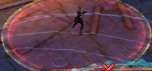

### Flame wall

Starting at about 8:30 on the timer, Sabetha does a flame wall attack.
It's then every 45 seconds as long as she's on the platform. If Sabetha
is not on the platform, she will do the flame wall as her first attack
when she's back.

The flame wall is telegraphed by a large arrow pointing at a random
player. It's very important to stack tightly and for the kite to not be
in a bad position when this happens so the flame wall goes where you
want it. You can guarantee if one person is badly placed, it'll choose
them.

Most groups will position themselves so the wall starts just past the
next cannon launchpad to give the thrower/cannon killer as much time as
possible without worrying about the flame wall.

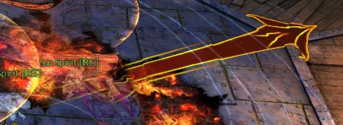

You can walk over the flame wall as long as it is an arrow and not
flames. Once it is flames, don't try to jump or dodge through it.
Technically as the flame wall ticks, it is possible, but it is a luck
thing. You can teleport over the wall with skills like Sand Swell or the
mesmer 2 downed skill.

The flame wall goes counter clockwise (right) for a full circle around
the platform - step to the left of the arrow (when facing Sabetha) when
it appears and you can then follow it right a few steps and continue
dpsing until it completes its rotation.

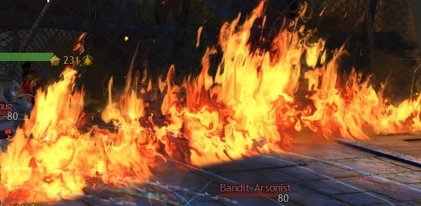

### Heavy bombs

Other than cannon fire, heavy bombs are the biggest threat to the
platform being "killed" and the fight failing. If they're allowed to
blow up, they'll do a large amount of damage to the platform. Remember
we're trying to kill Sabetha before the platform "dies".

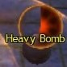

These cannot be killed in the usual way - someone has to run up to the
heavy bomb and interact with it to Kick it and defuse it. Usually this
is the kite or stack heal's job so everyone else can get on with doing
their best dps.

Heavy bombs have a circle above them which counts down how long until
they explode. You want to defuse them as soon as possible because they
can explode and knock you back if you try late in its "life".

### Mini bandits

You can mostly ignore these, although there are two to watch out for:

:white_check_mark: Bandit Sappers - these
provide the green bombs to throw people to cannons so it's important one
is alive at the time you need to go to the cannon. Try not to pull these
in to die to cleave.

:white_check_mark: Bandit Thugs - these like
to kick people and knock them back. This can be incredibly dangerous
during a flame wall or when someone is waiting to be thrown to a cannon
(they can get kicked off the platform). Try and kill these where
possible.

------------------------------------------------------------------------

## Cannons

This could arguably be the hardest mechanic, solely because of the
things that could go wrong and make it harder - once you get the hang of
the timings, it's not that hard.

First, choose two players to do cannons. They'll do 2 cannons each and
will be called 1-3 or 2-4. The flame wall appears closer to 1-3 than
2-4, so I normally suggest people new to cannons start on 2-4.

These players will be away from the platform for a fair chunk of time
and can be either power or condi, but the quicker they can kill their
cannons, the more time they can spend hitting Sabetha - send two dps
players. I know some groups have a rule that their top dps is exempt
from cannons and any other dps can do them. You don't really want to
send your alacrity or quickness unless you have to as that will make dps
on the main platform harder.

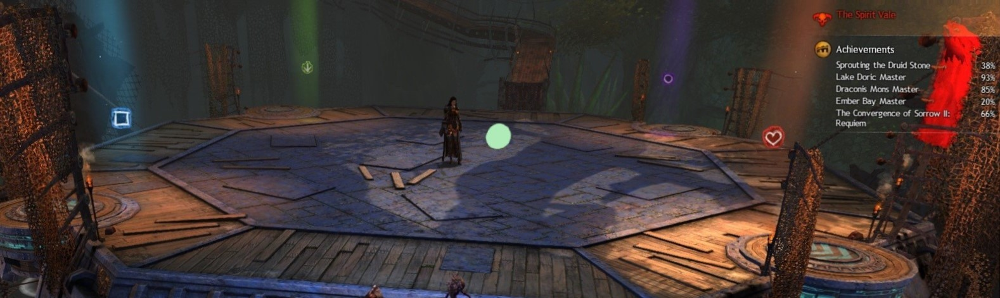

The cannons spawn at xx:30 and xx:00. They will follow the following
pattern (these are the same but in different terms for different
people):

|Arrow | Circle | Heart | Square || Arrow | Heart | Circle | Square|
|------|--------|-------|--------||-------|-------|--------|-------|
|Green | Purple | Red   | Blue   || Green | Red   | Purple | Blue  |
|South | West   | North | East   || South | North | West   | East  |

So for example, person 1-3 will do Arrow - Heart - Arrow - Circle
(S-N-S-W). This will repeat for the whole fight - most groups will get
to a second set of the above rotation.

Cannons will happen throughout the whole fight regardless of what is
happening on the main platform with Sabetha. If you end up in the enrage
timer, all 4 cannons will spawn every 30 seconds.

The person furthest west of the Bandit Sapper, who is also in range of
the Sapper, will get the green bomb (special action key). The special
action key is ground targeted. Because of the predictable nature of the
spawn, it can be grabbed by the kite on a consistent basis. You want to
be around star marker to get the green bomb (note this is the pale green
blob above as I don't currently have a picture with star on).

The Sapper spawns the green bomb at xx:24 and xx:54 on the timer for the
respective cannons. Other green bombs will be spawned at different times
in the fight, but those can be thrown onto Sabetha for a little extra
dps. Note that later in the fight, two green bombs will be spawned at
once.

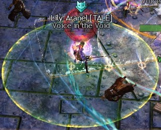

The special action key looks like:

{Picture of special action key}

Once the cannon has spawned at xx:30 or xx:00, the person doing that
cannon should go and stand near their launchpad. Do not stand on it as
you'll become the kite and Sabetha will throw fire at you. Also keep an
eye out for flame walls that mean you have to move.

At xx:24 or xx:54 when the green bomb spawns, the cannon person should
go onto their launchpad and the person with the green bomb should throw
it on the launchpad. You will need to move slightly out of the stack to
have the launchpad in range, but not very far (halfway towards the
launchpad is plenty).

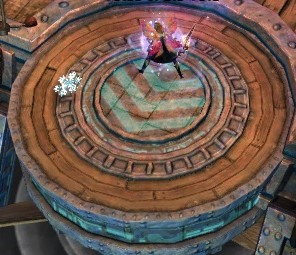

Once you get to the cannon platform, ignore anything other than the
cannon, dps the cannon down, and glide back. Before gliding back you
will need to check whether there is a flame wall that you might fly
into. If you're in voice, have someone on the platform call when there's
a flame wall so you can watch it pass you.

Sabetha may be on your cannon platform. She is invulnerable so there's
no point hitting her.

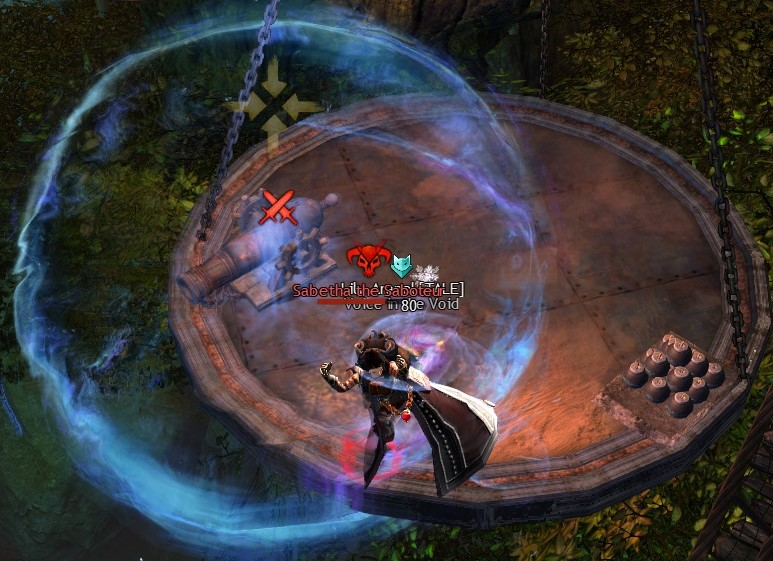

It is worth noting that if your platform's health is high, some groups
will stop doing cannons towards the end of the fight.

The reason we kill the cannons is that they fire on the platform. This
does damage and burning to anyone in the aoe circles, and also damages
the platform. If the platform's health is high, and you're confident you
can out dps the cannons, go ahead and ignore them in the last 20% or so
(we tend to do 10% but I mostly run trainings).

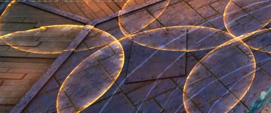

------------------------------------------------------------------------

## Flak kite

The other role that needs to be filled here is Flak Kite. Sabetha throws
a lot of large fire aoes that cause burning at the person who is
furthest away from her. Someone needs to kite this to make sure the aoes
don't appear on the stack.

Anyone with ranged ability can do this. Usually a heal will perform this
role. If you're solo healing, you can still perform this role, but it'll
involve a lot of moving. The flak shots are about 7 seconds apart (or 2
attacks) so count and move accordingly.

If you are kiting, you should try and kite behind the group in a
sensible place when the flame wall is about to appear.

During the mini boss phases, there is nothing to kite, so you can stay
with the stack until Sabetha comes back.

You can also catch the green bombs when you're kiting. The star marker
is about where you want to be to make sure you catch them - you want to
be there just before xx:24 and xx:54 on the timer.

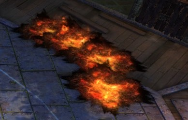

------------------------------------------------------------------------

## Phase 2

Kernan is the first mini boss of the Sabetha fight. She replaces Sabetha
at 75% health.

Kernan will follow players around the platform, so try to keep her in
the middle where possible. She will attack in a 3 phase cone pattern.
Once she picks a direction, she is fixed so you can move away - try to
side step the cones anyway as they do quite a lot of damage. They do
more damage the larger they get. You can also block or dodge them.

Once you get Kernan to 25% health, Sabetha will come back to the
platform. She will probably start with a flame wall. Continue focussing
on Kernan until she is dead before starting to attack Sabetha again.

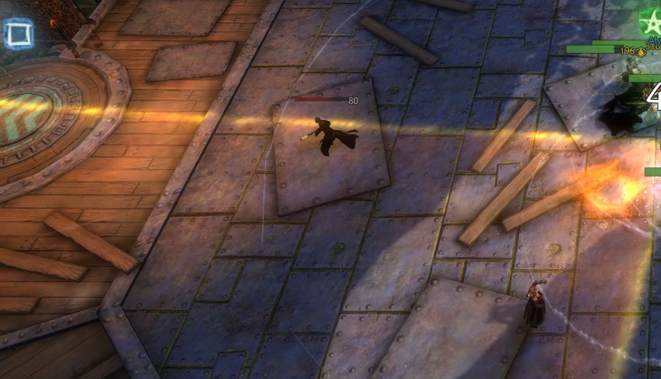

------------------------------------------------------------------------

## Phase 4

"Knuckles" (not his real name) is the second mini boss. He replaces
Sabetha at 50% health.

Whilst the third mini boss has the most damage potential, Knuckles has
the most annoying attack. The most important thing in this fight is to
break Knuckles' cc bar asap. Every 30 seconds you get 5 seconds to do
1,000 cc to him.

If you don't manage to break his bar, he will throw everyone on the
platform into the air and knock them back a long way. If you are in the
centre of the platform, you'll be ok, but if you're going to a cannon or
are otherwise not in the centre, you'll probably get kicked off and die.
You can sometimes use your glider whilst in the air to get back to the
platform.

Once he gets to 25% health, Sabetha comes back. As before, she will
probably start with a flame wall. Continue to kill Knuckles before
hitting Sabetha as he can still do his cc bar attack during flame
wall!

{Picture of Knuckles/cc bar}

------------------------------------------------------------------------

## Phase 6

Karde is an engineer with flame turrets, and the final mini boss of this
fight. He replaces Sabetha at 25% health.

He places flame turrets which do large amounts of damage around the
platform. At least one dps player should go and kill these as quickly as
possible.

He also uses a flamethrower, which does large amounts of damage to
anyone caught in its stream. Try not to get hit by this.

It's worth noting that whilst you're learning this fight, Karde and
later in the fight will feel like it's absolute chaos. That's fine -
there are a lot of things going on by this point.

Flame turret:

{Picture of flame turret}

Karde and flamethrower:

{Picture of Karde's flamethrower attack}

------------------------------------------------------------------------

## Phase 7

In Sabetha's final phase, she has one more mechanic - platform debris.
She causes pieces of debris to fall onto the platform. This damages
players in the solid orange aoe circles and also damages the platform.

Phase 7 is basically a race against the clock for whether players can
kill Sabetha before she kills the platform. Anyone on the main platform
should make sure they stand in as little damage as possible, especially
if you only have a solo healer.

------------------------------------------------------------------------

## Masteries

The people who go and do cannons will need gliding mastery. Having lean
gliding can be helpful if you need to slow down to avoid a flame wall.
Stealth gliding can also be useful to stop snipers hitting you.

The second raid mastery (Explosive Launch) will prevent you from taking
damage when you're launched by the green bombs.
