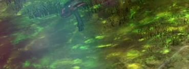

Slothasor, known as Sloth, is the first boss in Wing 2 (Salvation Pass).
His hobbies include sleeping, giving people poison fields, eating lots
of spicy things and shaking like a wet dog. He is accompanied by lots of
little worm like creatures called Slublings who respawn throughout the
fight. These are baby sloths but they can be more deadly than Sloth
himself.

------------------------------------------------------------------------

## What sort of classes do I want to bring here?

- Damage type: Power or condi. Note that Sloth removes condis when he gets
his breakbar so plan accordingly.
- Tanking type: Random.
- Healers: I'd suggest duo heal and as much condi cleanse as you can.
- Boon thief: No. The stolen skill here is Soul Stone Venom - although
this is a good condi cleanse.
- Encounter specific mechanics: Anyone can become the tank. You need lots
of condition cleanses. Pulls for the slublings are really helpful.

------------------------------------------------------------------------

Markers for mushrooms:

The middle four markers are for the tanking spots for mid strat (star,
spiral, triangle, cross). Personally mid strat is the safest as you're
closer to the slublings so you can clear them more easily. Wall strat
(eating along the wall instead) will require more pulls or reflects or
higher damage.

Mushrooms go anti clockwise (or right), so the first one is at us, the
2nd is on the right of the screen, 3 is at the top right of the screen
and 4 is on the top left of the screen.

------------------------------------------------------------------------

## Phases

Sloth doesn't really have phases as such. He has mechanics which occur
throughout the fight - some start later in the fight and some start at
the start of the fight. His two main states are:

1. Damage - has mechanics and actively tries to kill you.
2. Sleep - he gets bored, goes to sleep, takes no damage, clears
conditions off of himself and gets a breakbar. Note that the breakbar
lasts for 2 minutes if you don't break it. Slublings and poison special
action keys still happen during this.

So instead of phases, we're going to list the mechanics below:

- Poison floor
- Mushrooms
- Flame breath
- Tantrum (blue circles)
- Poison special action key
- Shake (or coconuts I've heard it called, but most people call it
shake)
- Sleep (breakbar)
- Slublings

------------------------------------------------------------------------

## Poison floor

The floor is a massive poison field. If the floor is green, do not stand
on it unless you *have* to. It will give you stacks of poison, which
will hurt and will cause you to receive less healing. The floor ticks so
you can sometimes stand on it without taking any damage or receiving any
poison for a short period of time.

The green floor can only be cleared by someone becoming a Slubling and
eating mushrooms to clear a path. Players can become a Slubling by
eating a sparkly blue mushroom. There are 4 of these mushrooms and they
appear in the four corners of the room.

Clear floor looks like this:

------------------------------------------------------------------------

## Mushrooms

There are two types of mushrooms - blue mushrooms and red mushrooms.

Blue mushrooms are eaten by a player to turn themselves into a
Slubling.

Player slublings are enemies to the rest of the squad so **do not** kill
them!

Do not pull the slubling, do not epidemic the slubling, do not throw
clones at the slubling, do not allow your pets to attack the slubling,
and most definitely do not run after the slubling attacking it! Yes I
have seen all of these things...

Player slublings walk up to the red mushrooms and use their 1 skill to
eat them. This then clears the floor of the green poison area and you
can move and stand on it. You can eat more than one red mushroom at once
if you're close enough to two.

There are 4 of the blue mushrooms throughout the room. They spawn one
after the other in the 4 "corners" of the room. Eating mushroom 1 will
start the fight, so be aware of that.

As the squad is stood basically on top of mushroom 1, it's usual to eat
it and then dodge forwards at least once, if not twice.

See the top of this guide for the paths to eat.

------------------------------------------------------------------------

## Flame breath

Sloth's main attack is breathing a cone of fire in front of him. For
this reason, if you are not the tank, you should be behind Sloth. It
does a lot of damage and several stacks of burning. He gets animation
locked, so the tank can side step or get behind Sloth once he starts his
animation.

{Picture of flame breath}

------------------------------------------------------------------------

## Tantrum (blue circles)

Sloth gets mad that we're attacking him and has a tantrum and pounds the
floor.

This causes blue circles to appear under players. Do not panic and run
around like headless chickens. There will be 3 circles that drop before
anything happens.

Watch Sloth, count to 2.5 and dodge. Or watch the first two drop, then
calmly walk out of the circles. If you move lots, you'll drop circles
everywhere and probably kill people as they won't have clear floor to
stand on.

The circles do a long knockdown and do a fair chunk of damage. The more
circles you are in, the more damage you will take. You can block the
circles but if you're relying on aegis, it is an aegis charge per
circle. Multi block skills like distortion, the f4 on virtuoso, shield 4
on chrono will all block all circles.

You do get a yellow border when stood in a circle, but it's a bit buggy
so I'd suggest watching the floor.

{Picture of blue circles}

The circles do have a slight delay on when you can move back to where
they were so wait a tick (1s) before going back to where you were.

If you have to stand on poison floor to get away from the circles, do
so. You'll only be there a short time.

------------------------------------------------------------------------

## Special action key - expanding poison

At regular intervals one random person in the group will get a special
action key. This will drop a poison field that does lots of damage to
anyone inside it and expands over time until eventually it disappears.

You want to go backwards to where your group has already been and place
the poison field as close as you can to a wall. This means that only
half of the expanded field will be inside the arena.

{Picture of placing poison field}

The first two special action keys can go at the start position. The 3rd
should go behind where the 2nd mushroom was. Then just take them
backwards and to a wall.

You can go over short stretches of poison floor if you have high health,
but don't try your luck too much. If you down, you will drop the poison
automatically so be particularly aware of shakes etc.

If the poison is placed in front of the group or the middle of the
arena, this often results in a wipe.

Badly placed poisons can also mean you have to change from mid strat to
wall strat. Eaters should always be aware of where the poison aoes
are.

{Picture of fully expanded poison field}

------------------------------------------------------------------------

## Shake

Officially called Spore Release if you want to know the "proper" name.

From 50% of his health bar, and then every 40 seconds, Sloth stands up
and shakes. This releases lots of spores that are aimed at where players
were at the release. The spores do lots of damage and cause stacks of
poison, torment and poison (5 stacks per hit). This can easily wipe the
group.

Techniques to deal with this:

- Double dodge towards Sloth. As the spores are aimed where you were,
this means they should hit behind you. If you're a long way from Sloth,
be aware of timing your dodge later.
- Druid brings Glyph of Stars and everyone hugs the druid.
- Mesmer with the inspiration traitline takes signets and jumps in
Sloth's hitbox to destroy the projectiles.

{Picture of Sloth standing for shake}

Projectiles:

{Picture of shake}

------------------------------------------------------------------------

## Sleep (breakbar)

Every 20% and at 10% (so 80%, 60%, 40%, 20%, 10%), Sloth takes a nap.

He gets a breakbar, removes all the conditions on him and doesn't take
any damage. If you don't break the bar, you have 2 minutes of waiting
until it ends, so break the bar and get back to dps.

The breakbar removing conditions is the main reason power classes are
preferred at Sloth, but honestly so many condi classes have short ramp
ups now so it doesn't really matter.

When the bar is broken, Sloth does a massive roar as he hates being
woken up and applies fear to everyone. Make sure you have a block, aegis
or stability for this or you'll run off into the distance and likely
die. You can also dodge at the end of the bar to avoid the attack.

{Picture of Sloth miles away}

You don't want to end up in the situation that Sloth is asleep on the
poison floor so the tank needs to keep him moving once floor is
cleared.

------------------------------------------------------------------------

## Slublings

Sloth is accompanied by baby sloths called Slublings. These reddish wurm
creatures shoot projectiles which corrupt boons into conditions.

There are two types : Slublings and Evolved Slublings. You can block the
projectiles from the normal ones but not the evolved version. Evolved
Slublings start spawning at 25% of Sloth's health.

You ideally want to pull the Slublings under Sloth to get cleaved. Often
mesmers get this task with a focus, but necro spectral grasp or rangers
or firebrand axe 3 can all be used. As mentioned above, be careful using
those skills when there is someone eating mushrooms as you don't want to
pull them.

Keeping on top of Slublings that spawn is really important as the more
you have around, the more likely you'll get lots of damaging conditions
on you and end up with no boons. Condi cleanse, epidemic, projectile
block or reflect and condition conversion to boons can also be helpful.
Just make sure not to epidemic your friendly enemy slubling!

------------------------------------------------------------------------

## Tanking

Anyone can become the tank. You get a purple diamond over your head and
a message across the screen.

Your job is to move Sloth to where he needs to be. He is quite slow and
will often stop to throw flame breath at you. Just be persistent at
moving him to the next place as soon as possible.

In the picture at the top of this guide, the middle 4 markers are the
tanking spots (star, spiral, triangle, cross) if you're doing the mid
strat. Try to avoid pulling Sloth to the next blue mushroom as you don't
want the stack on top of where the player is going to turn into a
slubling - you will most likely kill them!

