Vale Guardian is the first boss of wing 1. He appears after three mini
bosses, who also appear during the fight. The first three guardians
(Red, Blue and Green) appear in a random order and are there to teach
the mechanics of the main fight.

------------------------------------------------------------------------

## What sort of classes do I want to bring here?

- Damage type: Power and condi (1-2 condi dps)
- Tanking type: Toughness
- Healers: Solo heal or Duo
- Boon thief: No

------------------------------------------------------------------------

## Markers for side tanking position

This is most common in pugs or training runs. Speed runs tend to mid
tank.

{Picture}

------------------------------------------------------------------------

## Phases

Once you've killed the three mini bosses and get to the main Vale
Guardian fight, he has three main phases and two split phases.

1. Hit the boss - here he comes to the side and you hit him, avoiding
mechanics until 66%.
2. Split phase - go and kill the mini bosses. The usual tactic is a 2
way split for training runs but 1 way and 3 way also are used.
3. Hit the boss - go back to the side and hit him, hopping floors until
33%.
4. Split phase - go and kill the mini bosses (like you did in 2).
5. Run in circles - starting midway between Red and Green pylons, move
the boss clockwise to avoid the floor killing you. Like "Hit the boss"
but in circles. KEEP MOVING!

------------------------------------------------------------------------

## Mini bosses - Red Guardian

Red Guardian is a condition damage mini boss. This is the reason that
most squads have 1 - 3 condition damage players. It's their job to kill
the Red Guardian. If you are condition damage, you will go to the red
pillar during split phases in the main arena.

Red pillar:

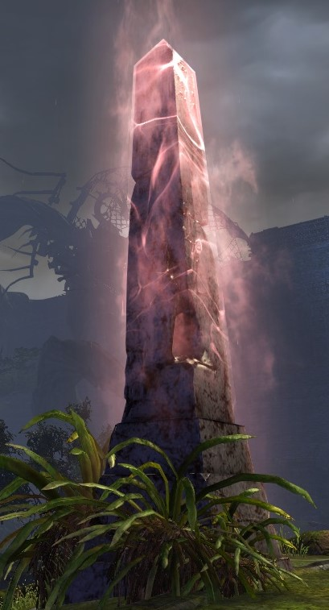

Red Guardian spawns red orbs called seekers. They have an AoE around
them (red circle). You do not want to stand in that circle. It hurts.

Usually the druid pushes the seekers away from the group, as the seekers
follow players. This is done using Glyph of Tides. The druid often also
takes Entangle as their elite skill in order to immobilise the seekers a
short distance from the group. This is because Glyph of Tides is not
always off cooldown depending on your seeker management and the length
of the phases. Remember to only use Glyph of Tides outside of CA
otherwise it pulls.

If less confident, the chrono(s) should take focus as their second
offhand to help pull the seekers away from the group. Whatever you do,
DO NOT PULL THE SEEKERS. Your group will hate you if you do.

The main skills that can pull seekers are:

- Firebrand - axe 3
- Dragonhunter - dragon's maw
- Dragonhunter - greatsword 5 on 2nd use (why are you using this twice
anyway here?!)
- Dragonhunter - F1 skill on 2nd use (see above - why?!)
- Chronomancer - gravity well (just bring time warp!)
- Chronomancer - focus 4
- Necromancer - spectral grasp
- Soulbeast - axe 4
- Condi renegade - axe 5
- Renegade - call to anguish
- Druid - iboga pet (fanged grapple happens every 20s to the target)

Handy note: seekers can be affected by epidemic, so feel free to abuse
that to kill them or use it to apply more conditions onto Vale Guardian
using epi bouncing. Usually you don't kill them but hey more dps whilst
you ignore them.

Seekers:

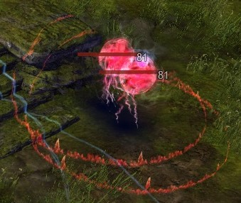

------------------------------------------------------------------------

## Mini bosses - Blue Guardian

Blue Guardian is usually thought of as power damage. Anyone not going to
Red Guardian comes to the blue pillar during split phases in the main
arena.

Blue pillar:

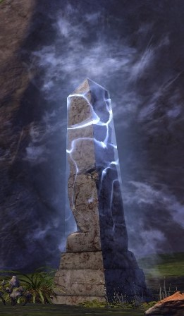

Blue Guardian has a protection buff which stops you doing damage to him.
It can be removed via usual boon removal, though is often taken care of
by a chrono's auto attack. Ensure you have at least one form of boon
removal in your squad that is going to the Blue Guardian.

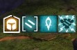

Blue Guardian's main mechanic is that he creates green circles in the
segment of the arena that the group is stood in. These circles lose
their colour - once the colour is gone, they will deal damage of 80% of
every squad member's health.

This can be prevented if 3 people are stood in the circle at that time.
If you have lower than 80% hp, you'll go into downed state. Most groups
ignore the green circles and have their healers "outheal", which
involves keeping the squad's hp above 80% and immediately healing the
group back up after the damage spike. Bringing barrier to artificially
increase the health bar helps a lot with the "outheal" strategy.

Green circle:

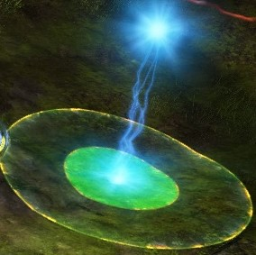

------------------------------------------------------------------------

## Mini bosses - Green Guardian

Green Guardian is usually thought of as power damage. The druid (or
someone else with at least 1,200 range) will attune to the blue area and
then go and attack the Green Guardian to bring it over to Blue Guardian
at the split phase in the main arena.

Green pillar:

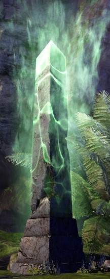

Green Guardian creates little blue circles at the feet of some players.
These circles teleport players to random points around the arena. It
could be really close or the absolute other side of the arena. The
circles have a crackle noise when they're around and they explode after
2 seconds.

You can tell if you're in a circle by the yellow border around the edge
of your screen. Teleport circles can be blocked or evaded or dodged,
just don't dodge into a different blue circle. You can only block a
single circle at a time with aegis, so if they're overlapping then aegis
won't work. You have enough time to walk out of a circle you're stood
in - just don't panic and side step it.

Blue circle:

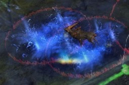

Yellow border (note this scales with Interface size and this is the
picture at "Large" size):

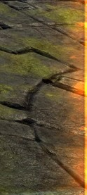

------------------------------------------------------------------------

## Vale Guardian - phases 1 and 3

This will assume all the way through that you're doing side tanking as
that's the most common tanking strategy.

The platform is split into 3 sections. These are Red, Blue and Green
sections. The centre of each section has a symbol in it which
corresponds to the symbol that appears above your head when you attune
to a section in the split phases. It's important to work out where the
section edges are and which one you're in so you don't get the wrong
marker.

You will start the main fight on the platform at the arrow marker. Arrow
is placed halfway between the blue pillar and the red pillar but on the
red section of the platform. When you come back for phase 3, you will
also start at arrow.

The edge of the arena gets a wall around it shortly after the fight
starts. If you are outside of this when the wall spawns, you will
instantly die. It is possible to start on the arena and then dodge or
walk outside of the wall accidentally (or pull Vale Guardian too far
when tanking) before the wall appears and then die. You want to stand
inside this black line (inside the ridge and then line):

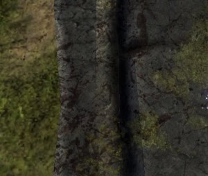

Vale Guardian is basically all three mini boss guardians in one. He has
some extra mechanics which you don't see in the three mini bosses but he
also has all of theirs with a couple of slight tweaks.

Usual mini boss mechanics:

- Seekers - Vale Guardian will spawn 3 of these at once around the
middle and they will travel towards the group.
- Green circles - During the Vale Guardian phases, these require 4
people not 3. You can ignore them if you're doing the "outheal"
strategy. They will spawn in the section that Vale Guardian is stood in
when he spawns them.
- Blue circles/teleports - These will happen on a regular basis and will
function like the ones that Green Guardian places.

Other Vale Guardian mechanics:

- Breakbar - Vale Guardian throws magic orbs around him which will
damage people in a small aoe where they land. To stop this, you have to
break the defiance bar. It needs 2,000 cc. The breakbar stays up for 30
seconds if not broken. He will not move whilst channelling this skill so
it is very important to break it quickly if he's standing in a place
that you don't want him to be.
- Autos - Vale Guardian will punch in front of him. These should only
hit the tank as everyone else should be behind him.
- Magic Aura - Vale Guardian and his mini bosses all have a magic aura
which pulses damage. The mini boss ones hurt more if you aren't attuned
to the colour of the guardian whose aura you're in, but it is
constant.
- Sparkly floor (actually called Unstable Pylon) - Vale Guardian will
turn one or two of the sections of the floor their relevant colour. If
the floor is coloured, it hurts so you should stay off of it. In Phase
3, one section of the floor is sparkly at a time - stand on the side of
arrow marker that isn't coloured. In Phase 5, two sections are sparkly
at once - we'll deal with that later.

Sparkly floor:

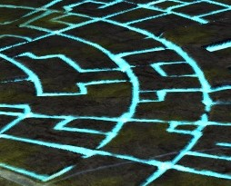

Breakbar/Magic Storm:

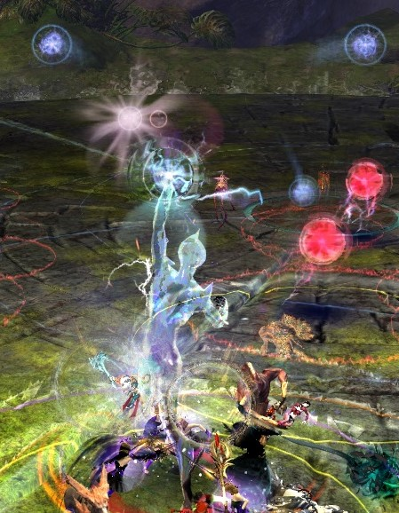

Once you get to 66% (or 33% at the end of phase 3), Vale Guardian will
become invulnerable and will run back to the centre and disappear. If
there is a green circle up at this stage, stay together at arrow to heal
up after the circle "explodes". It might be best to ensure that you're
on the correct side of the section line during this so that you don't
accidentally get the wrong attunement when the next phase starts.

------------------------------------------------------------------------

## Split phase - phases 2 and 4

After Vale Guardian disappears, everyone in the arena will get a
coloured symbol over their head. This corresponds to the section of the
arena that you're stood in at the time the symbol appears. If you are a
condi class and assigned to red, you will want a red symbol. Everyone
else should get a blue symbol. These symbols make you take less damage
from the corresponding guardian's aura. Without a related symbol, you
will take a lot of damage each tick from the guardian aura.

Once they have attuned to blue, the druid (or other ranged class) should
hit the Green Guardian to bring it to the Blue Guardian. These two are
usually fought together. The Blue Guardian should be the priority as he
creates the green circles. These circles must be stood in during this
stage to protect the people who went to Red Guardian as they usually
will not have a healer with them.

Once a guardian's health is 0%, they will gain a breakbar. They can
still do their usual mechanics whilst this bar is up. Once the breakbar
is broken, the guardian will die and any related mechanics will
disappear. For example, if you break the Blue Guardian's breakbar and
kill him, any green circles that are up will disappear and do no damage
to the group.

During this phase the guardians act like they did in the pre-event and
have the same mechanics.

Red attunement:

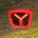

Blue attunement:

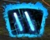

Green attunement:

{Picture of green attunement}

During this phase, there will be white orbs floating about the arena.
These are called Bullet Storm and will damage you for a small amount
each if they hit you. They float in fairly straight lines so should be
easy to avoid. Near the middle of the arena the paths are more likely to
cross which makes them harder to avoid.

Bullet Storm:

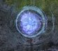

Once all three of the guardians have been killed, Vale Guardian will
reappear in the centre of the arena. He is invulnerable for a short
while after he appears so be aware that most skills won't hit him for
that time.

------------------------------------------------------------------------

## Final phase - phase 5

This phase is like phases 1 and 3, but with movement!

You usually start at circle marker. Circle marker is at the red/green
section line on the red side and halfway between the edge and the centre
of the arena.

Vale Guardian will follow the tank there and will cast blue circles and
seekers and then quickly follow that with Magic Storm (his skill with a
breakbar). You will want to break this as soon as you can to be able to
start moving. Ideally you want to be on the green section before the
green circle appears.

During the final phase, 2 of the sections of floor will be lit up at any
given time. You want to keep moving Vale Guardian to the far side of the
non sparkly floor so that you're next to the next section that will stop
being sparkly. The floor moves clockwise so you will do too. Green and
blue are the floors that start lit up, then blue and red etc.

You will want to take green circles where it is possible to do so during
this phase as it significantly reduces pressure. You'll be running
through seekers, trying to side step blue circles and be taking ticking
damage from Vale Guardian's aura. Remember you need four people for the
Vale Guardian green circles. If the green is on a sparkly floor, do not
take it and instead stack up to help your healers.

Keep circling the arena until Vale Guardian is dead.

------------------------------------------------------------------------

## Tanking - side strategy

Most groups will tank at the side of the arena. This allows the tank to
dodge backwards into the wall to avoid the blue circles and means that
any class can tank Vale Guardian. The tanking spot for the first 66% of
the fight (until after the 2nd split phase) is on the red side of the
red/blue section divide. In phase 3, make sure to hop floors to keep off
the sparkly one.

As the wall is unlikely to be up for a short while after the start of
the fight, ensure you don't accidentally walk backwards out of the arena
when Vale Guardian runs towards you. If you are the person in charge of
starting the fight then don't run back to the tank spot too quickly. Let
the wall appear as Vale Guardian is quite slow at running.

After the blue circles and the green circles Vale Guardian likes to
punch you. Make sure your health is high enough or that you have a block
ready to stop him instantly downing you. Even in high toughness gear,
this can hit hard.

If you are tanking on a chronomancer, you can trait into inspiration
(grandmaster trait 3) and bring a signet or two to make yourself
invulnerable for the greens. This means you take no damage and are
therefore healthy for when Vale Guardian punches you straight after. The
timing is a little tricky - Signet of Inspiration is easier than Signet
of the Ether as it has a shorter cast time. You want to cast SoI when
there is barely any green left in the circle. For SotE it wants to be
about 20-30% full.

Circle for SoI casting:

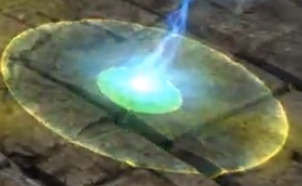
